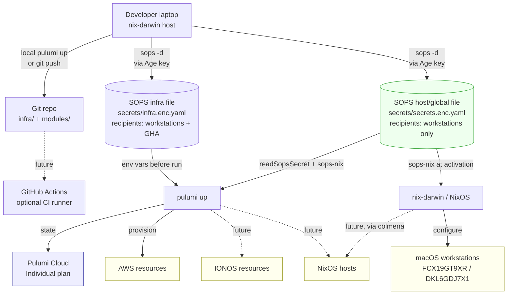
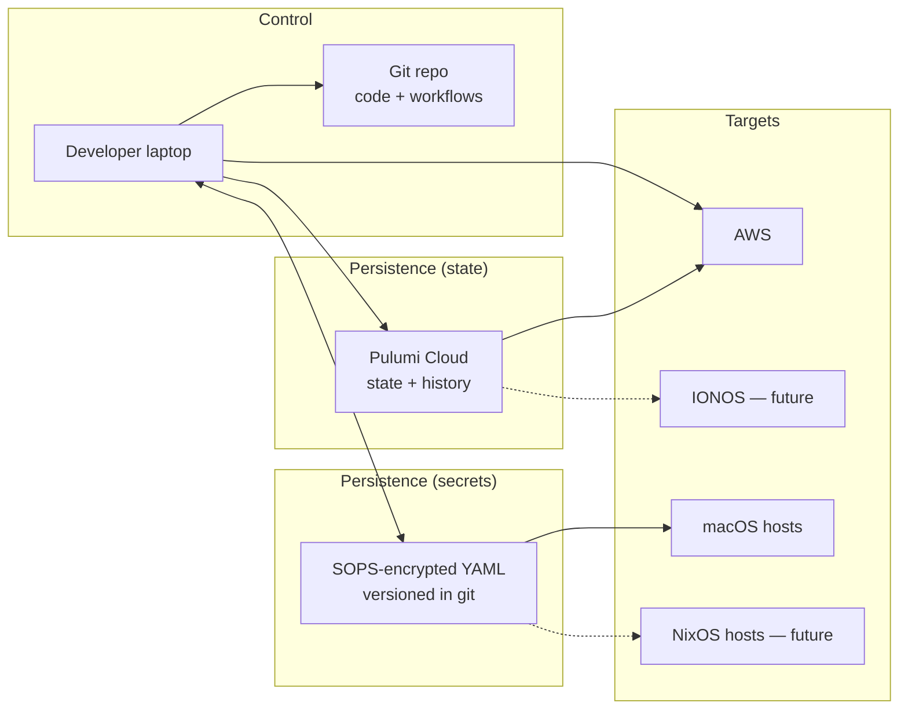
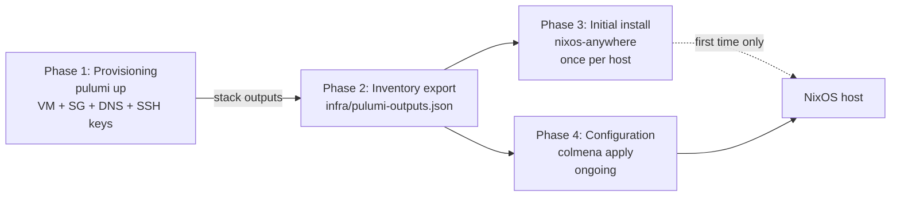

# Architecture: Pulumi + Nix in this repository

> **Scope:** Solo-engineer setup. Cloud infrastructure (AWS first, IONOS later)
> defined in Pulumi/TypeScript; macOS workstations and (future) NixOS hosts
> configured via the existing flake-parts/dendritic Nix flake. Secrets are
> shared between Pulumi and Nix through SOPS — no separate secret manager.

This document describes *what is built* and *why those choices were made*. The
companion file [`Plan.md`](./Plan.md) describes *what to build next* in
incremental phases.

## 1. Big picture

## 2. The three orthogonal axes

Pulumi setups are often described in a tangled way because three independent
decisions are merged into one story. Separating them:

| Axis | Question | Our choice | Why |
|---|---|---|---|
| **A — Runner** | Where does `pulumi up` execute? | Developer laptop today; GitHub Actions enabled later without re-architecture | Solo engineer, infrequent changes; CI becomes worth it once a second person joins or unattended PR previews matter |
| **B — State** | Where does Pulumi state live? | Pulumi Cloud (Individual, free) | Web UI + history + encryption-as-a-service for $0 |
| **C — Secrets** | Where do credentials and generated secrets live? | SOPS (Age, sops-nix) — single source of truth, split across two files | Already integrated with nix-darwin; one fewer system. The split lets CI decrypt only what it needs |

Each choice is independent. The secret model is *deliberately designed for
both runners*: when GHA later joins, its Age key becomes an additional
recipient on the infra file — no migration to a different secret store.

### The two SOPS files

| File | Recipients | Holds |
|---|---|---|
| `secrets/secrets.enc.yaml` (existing) | Workstation Ed25519-derived Age keys + recovery PGP | Runtime secrets consumed by sops-nix on macOS hosts: AWS credentials, third-party API keys for Home Manager, etc. |
| `secrets/infra.enc.yaml` (new — Phase 1) | Workstation Age keys *that run Pulumi* + recovery PGP + (later) one GitHub Actions Age public key | Secrets needed *to operate* Pulumi: `PULUMI_ACCESS_TOKEN`, `IONOS_TOKEN`, eventually a deploy SSH key for colmena |

Why split:

- **Least-privilege for CI.** A GitHub Actions runner does not need to
  decrypt the laptop user's API keys or AWS profile. Limiting its recipient
  scope to `secrets/infra.enc.yaml` means a compromised CI Age key can only
  read infra-operation secrets, not personal ones.
- **Independent rotation.** Adding/removing the GHA Age key (`sops
  updatekeys secrets/infra.enc.yaml`) does not re-encrypt the much larger
  global file or invalidate any cached decryptions on the laptops.
- **Different consumption paths.** Global SOPS secrets land on Macs at
  activation time via sops-nix (one process, one decryption). Infra secrets
  are loaded into the *environment* of the `pulumi` process by a wrapper
  (just recipe locally, workflow step in CI) — they never sit in
  `~/.aws/credentials` or similar.

### Why SOPS, not 1Password?

The reference architecture this repo is loosely inspired by uses 1Password as
the primary runtime store and SOPS only for committable build-time values. We
invert that:

- **sops-nix is already load-bearing.** Every Mac in this repo decrypts
  `secrets/secrets.enc.yaml` at activation time using the host's Ed25519 SSH
  key (converted to Age). Adding 1Password would mean two parallel secret
  systems.
- **No subscription dependency.** Service-account tokens and Watchtower
  features cost ongoing money; SOPS costs nothing.
- **One file to audit.** Encrypted YAML in git gives a versioned, diff-able
  history of every secret change. Loss of a service-account token does not
  lock us out of any secret.
- **Trade-off:** SOPS does not "generate" secrets. When Pulumi creates a
  random password, we either commit it back to SOPS (writeable bridge — see
  Plan.md Phase 2) or treat the resource as the source of truth and re-read
  it from the cloud provider. We accept this asymmetry.

## 3. Components and responsibilities

| Component | Responsible for | NOT responsible for |
|---|---|---|
| Git repo | Pulumi code, Nix flake, both encrypted SOPS files, justfile | Decryption keys, Pulumi state |
| Developer laptop | `pulumi up`, `darwin-rebuild switch`, `sops edit`, holding the Age private key | Long-lived state |
| `secrets/secrets.enc.yaml` | Host-runtime secrets distributed by sops-nix to macOS workstations | Anything CI needs to read |
| `secrets/infra.enc.yaml` | Tokens needed to *run* Pulumi (state backend, providers, deploy keys) | Host-runtime secrets unrelated to infra |
| Pulumi Cloud | Resource state, encryption-as-a-service, web UI, history | Secret distribution to runtime |
| `nix develop` shell (devenv) | Tool versions: pulumi, node, pnpm, sops, ssh-to-age; pre-commit hooks | Anything host-specific |
| GitHub Actions (future) | Unattended `pulumi preview` / `pulumi up` once enabled | Local-only operations like `darwin-rebuild` |

## 4. Secret categories

Even with SOPS as the single store, secrets fall into distinct lifecycles.
The two columns that drive the workflow are *which file* the secret lives in
and *who reads it*.

| Category | Example | SOPS file | Who writes | Who reads |
|---|---|---|---|---|
| **Pulumi-state auth** | `PULUMI_ACCESS_TOKEN` | `infra.enc.yaml` | Human (one-shot, on Pulumi Cloud) | A `pulumi` wrapper that exports it as env var before `pulumi up` |
| **Cloud-auth — static** | `IONOS_TOKEN` (future) | `infra.enc.yaml` | Human via `sops edit` | `pulumi` wrapper, env var to provider |
| **Cloud-auth — federated** *(future)* | AWS role ARN + OIDC trust | not a secret — repo variable / `.github/` config | Human (one-shot, in AWS) | GHA via `aws-actions/configure-aws-credentials` |
| **Cloud-auth — local AWS** | `aws-access-key-id`, `aws-secret-access-key` | `secrets.enc.yaml` (existing) | Human via `sops edit` | sops-nix → `~/.aws/credentials` on the laptop |
| **App input — host runtime** | OpenAI / Atlassian / Jira tokens | `secrets.enc.yaml` (existing) | Human via `sops edit` | Home Manager modules at activation |
| **Pulumi-generated → infra** *(Phase 2)* | colmena `deploy_key`, host `provisioning_key` | `infra.enc.yaml` | Pulumi via `command.local` running `sops set` | `pulumi` wrapper + colmena step in CI |
| **Pulumi-generated → host runtime** *(Phase 2)* | DB password that an app on a Mac needs | `secrets.enc.yaml` | Pulumi via `command.local` running `sops set` | sops-nix at `darwin-rebuild switch` |
| **Pulumi-generated → cloud-only** | AWS Secrets Manager entries with auto-rotation | not in SOPS | AWS | Cloud apps with IAM permissions |

**Routing rules:**

- *Operate Pulumi* → `infra.enc.yaml` (recipients are runners, not hosts).
- *Land on a Mac at activation time* → `secrets.enc.yaml` (recipients are
  workstations, not CI).
- *Live entirely inside one cloud* → that cloud's secret store (no SOPS).

## 5. Trust anchors

The minimum trust state that lives *outside* of SOPS — i.e. the keys and
identities required to decrypt SOPS in the first place, or to authenticate to
clouds that don't go through SOPS.

| Anchor | Where | Held by | Decrypts | Created in |
|---|---|---|---|---|
| **Workstation Age key** | `~/.ssh/id_ed25519_sops_nopw` (laptop), Age form via `ssh-to-age` | Each developer Mac (one per host) | Both SOPS files | Already exists |
| **Recovery PGP key** | Developer's GPG keyring | Human | Both SOPS files | Already exists |
| **AWS — local** | `~/.aws/credentials` populated by sops-nix from `secrets.enc.yaml` | Laptop | n/a (consumed by AWS SDK) | Already exists |
| **AWS — CI** *(Phase 5)* | GitHub OIDC trust policy on an IAM role; ARN as a public repo variable | AWS account | n/a (assumed via STS) | Created when CI is enabled |
| **GitHub Actions Age key** *(Phase 5)* | Private form: GitHub repo secret. Public form: recipient on `infra.enc.yaml` only | GitHub Actions runner | `infra.enc.yaml` *only* | Created when CI is enabled |

Notes:

- **`PULUMI_ACCESS_TOKEN` is no longer a trust anchor** — it lives inside
  `infra.enc.yaml`, decrypted by whichever Age key the runtime holds. The
  laptop's `~/.pulumi/credentials.json` is treated as a cache only; the
  source of truth is SOPS.
- **The GHA Age key has narrower scope than the laptop key.** Compromise of
  the GitHub repo secret leaks `infra.enc.yaml` contents but cannot decrypt
  any host-runtime secret in `secrets.enc.yaml`. This is the whole point of
  the file split.
- **AWS in CI does not need a key in SOPS at all** — OIDC issues short-lived
  STS credentials directly to the workflow, scoped by the trust policy's
  `:sub` condition (`repo:<OWNER>/<REPO>:environment:prod`).

## 6. NixOS lifecycle (forward-looking)

This repo currently manages only macOS hosts via nix-darwin. When the first
NixOS host is added (planned per the upcoming-hosts memory), we will adopt the
following four-phase model. Pulumi and Nix belong in *different* phases of the
lifecycle but in the same workflow; they communicate through a JSON inventory
file committed to the repo.

| Phase | Frequency | Tool | State location |
|---|---|---|---|
| Provisioning | rare (weeks/months) | Pulumi | Pulumi Cloud |
| Inventory export | every `pulumi up` | `pulumi stack output --json` | Git-committed JSON |
| Initial install | once per host | `nixos-anywhere` | NixOS generation on the host |
| Configuration | frequent (daily) | `colmena apply` | NixOS generation on the host |

The inventory file (`infra/pulumi-outputs.json`) is the contract: Pulumi
writes it; Nix modules consume it via `builtins.fromJSON`. Sensitive fields
are filtered out (`--show-secrets=false`); generated secrets live in SOPS, not
in the inventory.

## 7. SSH-key strategy (forward-looking)

When NixOS hosts arrive, three keys with cleanly separated lifecycles:

| Key | Purpose | Created by | Becomes obsolete when |
|---|---|---|---|
| `provisioning_key` | Initial root login on a freshly provisioned VM | Pulumi `tls.PrivateKey` | After first `nixos-anywhere` run; not in `authorized_keys` afterwards |
| `deploy_key` | Ongoing colmena deployments | Pulumi `tls.PrivateKey`, written to SOPS | Manually rotated |
| `user_keys` | Personal SSH from the laptop | Yubikey / 1Password SSH agent (workstation-side, *not* repo-managed) | Never automatically |

Security gain: the `provisioning_key` is useless after initial install,
because the NixOS configuration only adds `deploy_pubkey` and user keys to
`authorized_keys`.

## 8. Deliberately not in scope

| Omitted | Reason |
|---|---|
| **1Password as a parallel secret store** | sops-nix already covers runtime distribution; one secret system is simpler |
| **Pulumi ESC** | 25-secret cap on Individual; nothing it does that SOPS+sops-nix doesn't |
| **Pulumi Deployments runner** | OIDC-from-Pulumi requires Team plan; local + future GHA is enough |
| **Drift detection** | Enterprise feature; workaround is a periodic `pulumi preview` |
| **`nixos-rebuild --target-host` from inside Pulumi** | Mixes provisioning and configuration; no clean rollback |
| **Multi-stack-per-environment** | Single `prod` stack until cross-stack references are actually needed |

## 9. Trade-offs and pain thresholds

### Local runner vs. GitHub Actions

| Local laptop ($0) | GitHub Actions (added later) |
|---|---|
| Zero CI to maintain | Unattended runs, PR previews |
| Decryption key already on laptop | Need to either commit a CI-only Age key or ferry it via OIDC |
| One-person trust model | Approval gates via Environments |
| Risk: forgetting to `pulumi up` after merging | Risk: secret-distribution complexity |

**Switch to GHA when:** a second person joins, or unattended `pulumi preview`
on every PR becomes valuable enough to justify the extra trust anchor.

### SOPS for everything vs. SOPS + 1Password

| Pure SOPS (current) | SOPS + 1Password (reference architecture) |
|---|---|
| One secret store, one decryption mechanism | Service Accounts can be scoped per workflow |
| Pulumi-generated secrets need an explicit `sops set` step | `pulumi-onepassword` provider writes natively |
| Audit via `git log secrets/` | Audit via 1Password Watchtower |

**Switch to 1Password when:** generated-secret volume gets high enough that
the `command.local`+`sops set` round-trip becomes friction, or another
consumer (mobile app, browser) needs the same secrets.

### colmena vs. nixos-rebuild --target-host vs. deploy-rs

`colmena` is the natural extension of the dendritic pattern (parallel
deploys, tag selection, flake-integrated). `deploy-rs` adds magic rollback;
worth it once a host becomes production-critical. `nixos-rebuild
--target-host` is fine for one host but doesn't scale.

## 10. Differences from the loose reference architecture

| Topic | Reference | This repo | Verdict |
|---|---|---|---|
| Primary secret store | 1Password vault `Pulumi-Infra` | SOPS (Age), split into `secrets.enc.yaml` (host runtime) and `infra.enc.yaml` (Pulumi operation) | **Architectural** — keep SOPS; the file split is what makes CI possible without 1Password |
| CI bootstrap secrets | `OP_SERVICE_ACCOUNT_TOKEN` + `PULUMI_ACCESS_TOKEN` as GitHub Secrets | A single GitHub Actions Age key as a GitHub Secret; everything else decrypted from `infra.enc.yaml` | Equivalent surface area, one fewer external system |
| Runner | GitHub Actions with OIDC | Local laptop today; GHA wired-ready (Phase 5) | **Phase difference** — same target, deferred |
| State backend | Pulumi Cloud Individual | Pulumi Cloud Individual | Same |
| Pulumi targets | AWS + IONOS + NixOS hosts | AWS first; IONOS + NixOS planned | Same destination, earlier phase |
| Package manager | npm | pnpm | Stylistic |
| TypeScript module style | CommonJS-flavoured | ESM (`nodenext`, `.js` import suffixes) | Stylistic |
| Project layout | `infra/pulumi/{Pulumi.yaml,index.ts}` | `infra/{Pulumi.yaml,src/index.ts}` | Stylistic |
| Pre-commit hooks | None defined | `gitleaks`, `nixpkgs-fmt`, `check-merge-conflicts` via devenv | Tighter |
| Devshell | Implicit | `devenv` flake module + direnv `.envrc` | Tighter |
| Inventory bridge | `pulumi-outputs.json` committed | Same pattern, deferred until first NixOS host | Will adopt verbatim |
| SSH-key strategy | Three keys, lifecycles separated | Same pattern, deferred | Will adopt verbatim |

The takeaway: the reference is a useful blueprint for the *NixOS-host* and
*GHA-runner* phases we have not yet entered. The deliberate inversion is the
secret-store choice, and that inversion is the right call given the existing
sops-nix integration.
