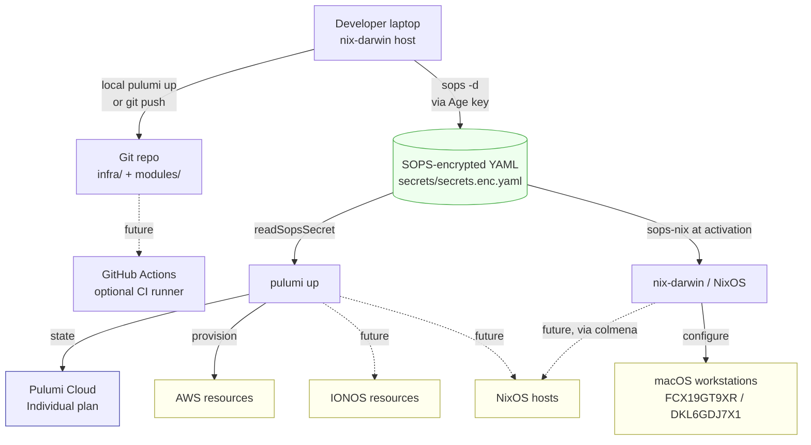
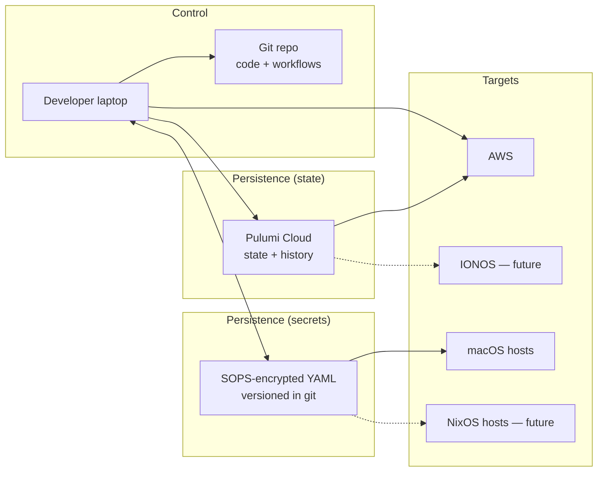
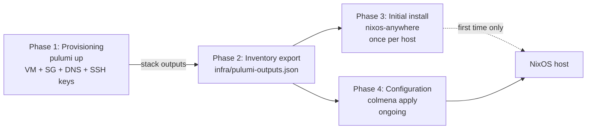

# Architecture: Pulumi + Nix in this repository

> **Scope:** Solo-engineer setup. Cloud infrastructure (AWS first, IONOS later)
> defined in Pulumi/TypeScript; macOS workstations and (future) NixOS hosts
> configured via the existing flake-parts/dendritic Nix flake. Secrets are
> shared between Pulumi and Nix through SOPS — no separate secret manager.

This document describes *what is built* and *why those choices were made*. The
companion file [`Plan.md`](./Plan.md) describes *what to build next* in
incremental phases.

## 1. Big picture

## 2. The three orthogonal axes

Pulumi setups are often described in a tangled way because three independent
decisions are merged into one story. Separating them:

| Axis | Question | Our choice | Why |
|---|---|---|---|
| **A — Runner** | Where does `pulumi up` execute? | Developer laptop (local) | Solo engineer, infrequent changes; CI is future work |
| **B — State** | Where does Pulumi state live? | Pulumi Cloud (Individual, free) | Web UI + history + encryption-as-a-service for $0 |
| **C — Secrets** | Where do credentials and generated secrets live? | SOPS (Age, sops-nix) — single source of truth | Already integrated with nix-darwin; one fewer system |

Each choice is independent of the others. We could later move runner to GitHub
Actions without touching the secret model, and vice versa.

### Why SOPS, not 1Password?

The reference architecture this repo is loosely inspired by uses 1Password as
the primary runtime store and SOPS only for committable build-time values. We
invert that:

- **sops-nix is already load-bearing.** Every Mac in this repo decrypts
  `secrets/secrets.enc.yaml` at activation time using the host's Ed25519 SSH
  key (converted to Age). Adding 1Password would mean two parallel secret
  systems.
- **No subscription dependency.** Service-account tokens and Watchtower
  features cost ongoing money; SOPS costs nothing.
- **One file to audit.** Encrypted YAML in git gives a versioned, diff-able
  history of every secret change. Loss of a service-account token does not
  lock us out of any secret.
- **Trade-off:** SOPS does not "generate" secrets. When Pulumi creates a
  random password, we either commit it back to SOPS (writeable bridge — see
  Plan.md Phase 2) or treat the resource as the source of truth and re-read
  it from the cloud provider. We accept this asymmetry.

## 3. Components and responsibilities

| Component | Responsible for | NOT responsible for |
|---|---|---|
| Git repo | Pulumi code, Nix flake, encrypted secrets, justfile | Decryption keys, Pulumi state |
| Developer laptop | `pulumi up`, `darwin-rebuild switch`, `sops edit`, holding the Age private key | Long-lived state |
| SOPS YAML | Runtime + build-time secrets shared by Pulumi and Nix | Pulumi resource state |
| Pulumi Cloud | Resource state, encryption-as-a-service, web UI, history | Secret distribution to runtime |
| `nix develop` shell (devenv) | Tool versions: pulumi, node, pnpm, sops; pre-commit hooks | Anything host-specific |

## 4. Secret categories

Even with SOPS as the single store, secrets fall into distinct lifecycles. The
column "Who writes" is the important one — it dictates the workflow.

| Category | Example | Who writes | Who reads | Notes |
|---|---|---|---|---|
| **Cloud auth (static)** | `aws-access-key-id`, future IONOS token | Human via `sops edit` | Pulumi via `readSopsSecret`; nix-darwin via `sops-nix` for `~/.aws/credentials` | Already wired (see `modules/secrets.nix:23-25`) |
| **App input** | Third-party API keys (OpenAI, Atlassian, …) | Human via `sops edit` | Home Manager modules at activation | Already wired |
| **Pulumi-generated → SOPS** *(future)* | RDS passwords, generated SSH deploy keys | Pulumi via `command.local` running `sops set` | Pulumi (next run) and sops-nix at activation | Phase 2 — see Plan.md |
| **Pulumi-generated → cloud-only** | Auto-rotated AWS Secrets Manager entries | AWS itself | Cloud apps that have IAM permissions | Avoid copying to SOPS unless a non-AWS consumer needs it |

**Rule of thumb:** if a secret needs to land on a Nix-managed machine, route
it through SOPS. If it only needs to be readable by another cloud resource,
let the cloud's own secret store hold it.

## 5. Trust anchors

The minimum trust state that lives *outside* of SOPS:

1. **The Age private key on the developer laptop** —
   `~/.ssh/id_ed25519_sops_nopw`, converted to Age via `ssh-to-age`.
   Recovery: each host's Ed25519 public key is registered in `.sops.yaml`;
   losing one host's key still leaves the others able to decrypt.
2. **`PULUMI_ACCESS_TOKEN`** in the developer's local Pulumi config (`~/.pulumi/credentials.json`).
   Bootstrap to Pulumi Cloud; one click to revoke.
3. **AWS credentials** for the IAM user/role that Pulumi uses. Currently
   read out of SOPS into `~/.aws/credentials`; later may be replaced by
   GitHub OIDC if a CI runner is added.

Everything else (third-party tokens, generated passwords, deploy keys) lives
in SOPS or in the cloud provider's own state.

## 6. NixOS lifecycle (forward-looking)

This repo currently manages only macOS hosts via nix-darwin. When the first
NixOS host is added (planned per the upcoming-hosts memory), we will adopt the
following four-phase model. Pulumi and Nix belong in *different* phases of the
lifecycle but in the same workflow; they communicate through a JSON inventory
file committed to the repo.

| Phase | Frequency | Tool | State location |
|---|---|---|---|
| Provisioning | rare (weeks/months) | Pulumi | Pulumi Cloud |
| Inventory export | every `pulumi up` | `pulumi stack output --json` | Git-committed JSON |
| Initial install | once per host | `nixos-anywhere` | NixOS generation on the host |
| Configuration | frequent (daily) | `colmena apply` | NixOS generation on the host |

The inventory file (`infra/pulumi-outputs.json`) is the contract: Pulumi
writes it; Nix modules consume it via `builtins.fromJSON`. Sensitive fields
are filtered out (`--show-secrets=false`); generated secrets live in SOPS, not
in the inventory.

## 7. SSH-key strategy (forward-looking)

When NixOS hosts arrive, three keys with cleanly separated lifecycles:

| Key | Purpose | Created by | Becomes obsolete when |
|---|---|---|---|
| `provisioning_key` | Initial root login on a freshly provisioned VM | Pulumi `tls.PrivateKey` | After first `nixos-anywhere` run; not in `authorized_keys` afterwards |
| `deploy_key` | Ongoing colmena deployments | Pulumi `tls.PrivateKey`, written to SOPS | Manually rotated |
| `user_keys` | Personal SSH from the laptop | Yubikey / 1Password SSH agent (workstation-side, *not* repo-managed) | Never automatically |

Security gain: the `provisioning_key` is useless after initial install,
because the NixOS configuration only adds `deploy_pubkey` and user keys to
`authorized_keys`.

## 8. Deliberately not in scope

| Omitted | Reason |
|---|---|
| **1Password as a parallel secret store** | sops-nix already covers runtime distribution; one secret system is simpler |
| **Pulumi ESC** | 25-secret cap on Individual; nothing it does that SOPS+sops-nix doesn't |
| **Pulumi Deployments runner** | OIDC-from-Pulumi requires Team plan; local + future GHA is enough |
| **Drift detection** | Enterprise feature; workaround is a periodic `pulumi preview` |
| **`nixos-rebuild --target-host` from inside Pulumi** | Mixes provisioning and configuration; no clean rollback |
| **Multi-stack-per-environment** | Single `prod` stack until cross-stack references are actually needed |

## 9. Trade-offs and pain thresholds

### Local runner vs. GitHub Actions

| Local laptop ($0) | GitHub Actions (added later) |
|---|---|
| Zero CI to maintain | Unattended runs, PR previews |
| Decryption key already on laptop | Need to either commit a CI-only Age key or ferry it via OIDC |
| One-person trust model | Approval gates via Environments |
| Risk: forgetting to `pulumi up` after merging | Risk: secret-distribution complexity |

**Switch to GHA when:** a second person joins, or unattended `pulumi preview`
on every PR becomes valuable enough to justify the extra trust anchor.

### SOPS for everything vs. SOPS + 1Password

| Pure SOPS (current) | SOPS + 1Password (reference architecture) |
|---|---|
| One secret store, one decryption mechanism | Service Accounts can be scoped per workflow |
| Pulumi-generated secrets need an explicit `sops set` step | `pulumi-onepassword` provider writes natively |
| Audit via `git log secrets/` | Audit via 1Password Watchtower |

**Switch to 1Password when:** generated-secret volume gets high enough that
the `command.local`+`sops set` round-trip becomes friction, or another
consumer (mobile app, browser) needs the same secrets.

### colmena vs. nixos-rebuild --target-host vs. deploy-rs

`colmena` is the natural extension of the dendritic pattern (parallel
deploys, tag selection, flake-integrated). `deploy-rs` adds magic rollback;
worth it once a host becomes production-critical. `nixos-rebuild
--target-host` is fine for one host but doesn't scale.

## 10. Differences from the loose reference architecture

| Topic | Reference | This repo | Verdict |
|---|---|---|---|
| Primary secret store | 1Password vault `Pulumi-Infra` | SOPS (Age) shared with sops-nix | **Architectural** — keep SOPS |
| Runner | GitHub Actions with OIDC | Local laptop | **Phase difference** — GHA is optional future work |
| State backend | Pulumi Cloud Individual | Pulumi Cloud Individual | Same |
| Pulumi targets | AWS + IONOS + NixOS hosts | AWS first; IONOS + NixOS planned | Same destination, earlier phase |
| Package manager | npm | pnpm | Stylistic |
| TypeScript module style | CommonJS-flavoured | ESM (`nodenext`, `.js` import suffixes) | Stylistic |
| Project layout | `infra/pulumi/{Pulumi.yaml,index.ts}` | `infra/{Pulumi.yaml,src/index.ts}` | Stylistic |
| Pre-commit hooks | None defined | `gitleaks`, `nixpkgs-fmt`, `check-merge-conflicts` via devenv | Tighter |
| Devshell | Implicit | `devenv` flake module + direnv `.envrc` | Tighter |
| Inventory bridge | `pulumi-outputs.json` committed | Same pattern, deferred until first NixOS host | Will adopt verbatim |
| SSH-key strategy | Three keys, lifecycles separated | Same pattern, deferred | Will adopt verbatim |

The takeaway: the reference is a useful blueprint for the *NixOS-host* and
*GHA-runner* phases we have not yet entered. The deliberate inversion is the
secret-store choice, and that inversion is the right call given the existing
sops-nix integration.
