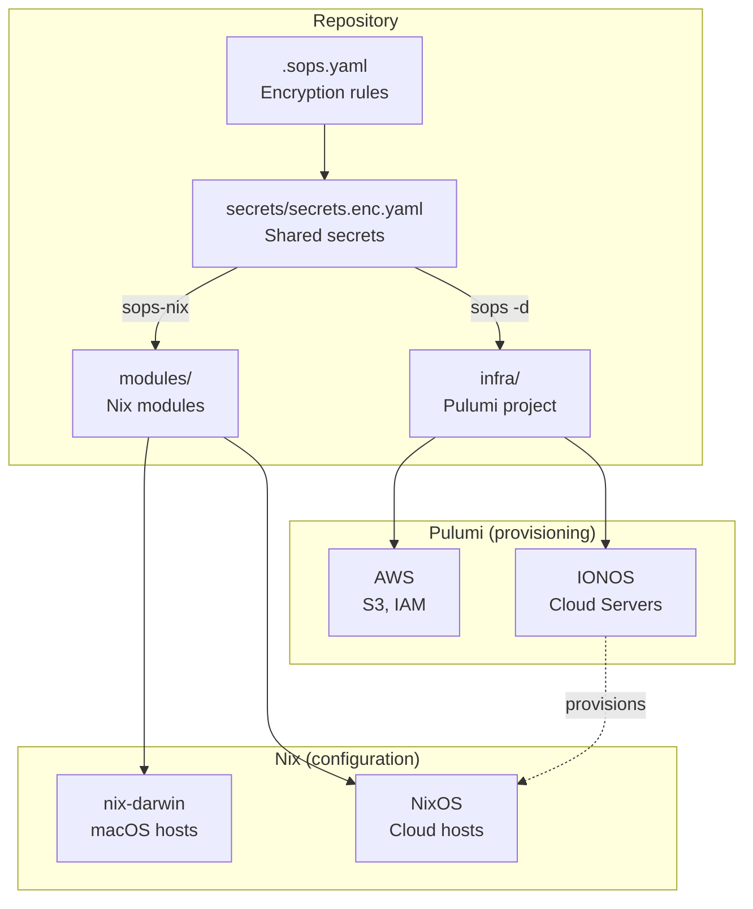
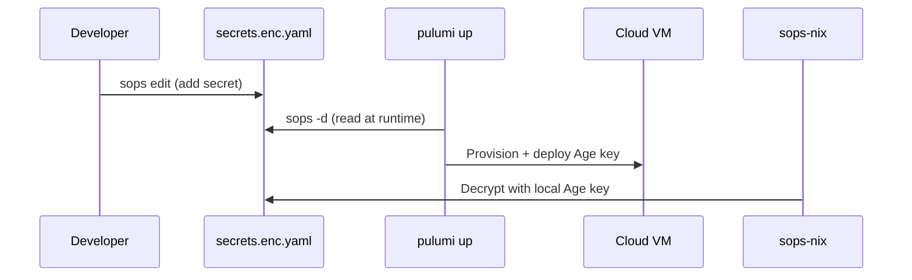
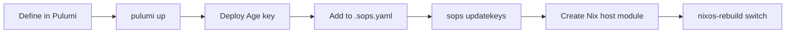

# Infrastructure (Pulumi + Nix)

Cloud infrastructure managed with [Pulumi](https://www.pulumi.com/) (TypeScript), deployed alongside [nix-darwin](https://github.com/LnL7/nix-darwin) host configurations. Secrets are shared between both systems via [SOPS](https://github.com/getsops/sops) with Age encryption.

## Architecture



## Secret sharing

Pulumi and Nix share the same SOPS-encrypted secrets. No duplication, no syncing.



## Prerequisites

All tools are provided by the Nix devShell -- no manual installation needed:

```bash
# Enter the devShell (from the repo root)
nix develop
```

This gives you: `pulumi`, `node`, `pnpm`, `sops`.

You also need a [Pulumi Cloud](https://app.pulumi.com/) account for state management:

```bash
pulumi login
```

## Quick start

```bash
# 1. Enter devShell
nix develop

# 2. Install dependencies
cd infra && pnpm install

# 3. Initialize a stack
pulumi stack init prod

# 4. Preview changes
pulumi preview

# 5. Apply changes
pulumi up
```

## Commands

Run from the **repo root** via `just`, or from `infra/` directly:

| Command | Description |
|---|---|
| `just pulumi-install` | Install Node.js dependencies |
| `just pulumi-preview` | Preview infrastructure changes |
| `just pulumi-up` | Apply infrastructure changes |
| `just pulumi-stack` | Show current stack state |

## Project structure

```
infra/
  Pulumi.yaml          # Project config (runtime: nodejs/pnpm)
  Pulumi.prod.yaml     # Stack config (created by pulumi stack init)
  package.json         # Node.js dependencies
  tsconfig.json        # TypeScript config
  src/
    index.ts           # Main program — resource definitions
    helpers/
      sops.ts          # readSopsSecret() — SOPS-to-Pulumi bridge
```

## SOPS bridge

`readSopsSecret()` reads values from SOPS-encrypted YAML at Pulumi runtime and wraps them as `pulumi.secret()` so they never appear in plaintext in state or logs.

```typescript
import { readSopsSecret } from "./helpers/sops.js";

const apiKey = readSopsSecret("../secrets/secrets.enc.yaml", "my-api-key");
```

Requires the `sops` CLI and a valid Age key at `~/.ssh/id_ed25519_sops_nopw`.

## Adding a new cloud host



1. Add the server resource in `src/index.ts`
2. Run `pulumi up` to provision
3. Deploy the SOPS Age key to the new machine
4. Add the host's Age public key to `../.sops.yaml`
5. Re-encrypt host secrets: `sops updatekeys ../hosts/<host>/secrets.enc.yaml`
6. Create a Nix host module at `../modules/hosts/<host>.nix`
7. Deploy NixOS configuration
