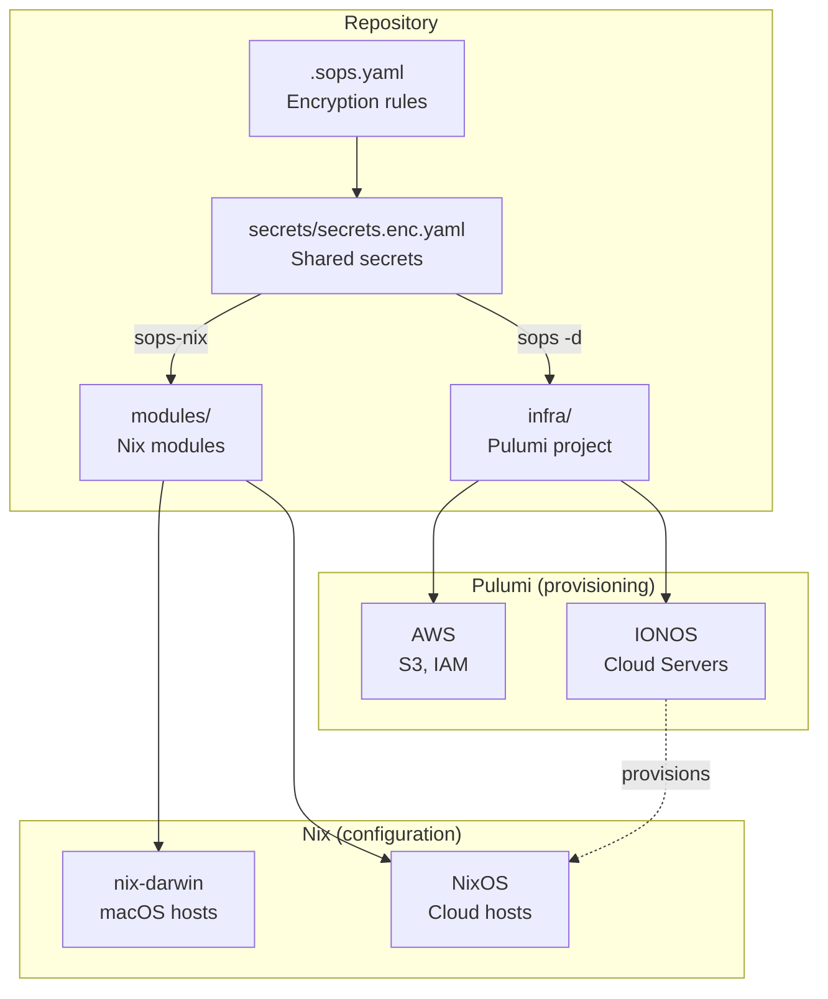
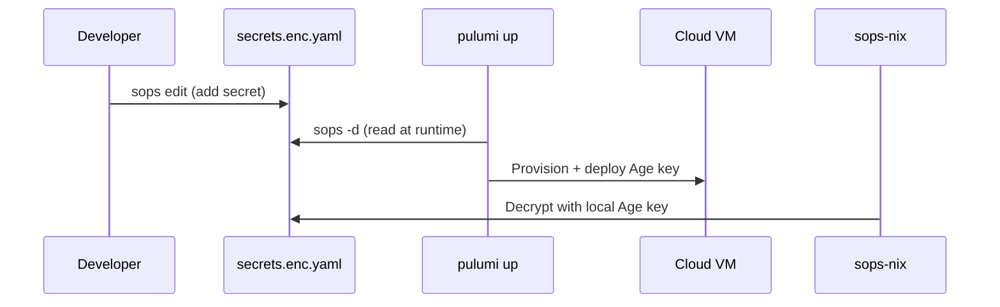
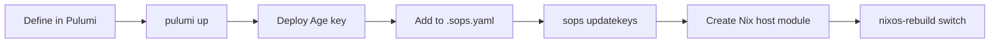

# Infrastructure (Pulumi + Nix)

Cloud infrastructure managed with [Pulumi](https://www.pulumi.com/) (TypeScript), deployed alongside [nix-darwin](https://github.com/LnL7/nix-darwin) host configurations. Secrets are shared between both systems via [SOPS](https://github.com/getsops/sops) with Age encryption.

## Architecture



## Secret sharing

Pulumi and Nix share the same SOPS-encrypted secrets. No duplication, no syncing.



## Prerequisites

All tools are provided by the Nix devShell -- no manual installation needed:

```bash
# Enter the devShell (from the repo root)
nix develop
```

This gives you: `pulumi`, `node`, `pnpm`, `sops`.

You also need a [Pulumi Cloud](https://app.pulumi.com/) account for state
management. Auth is token-based: `pulumi_access_token` lives in
`secrets/infra.enc.yaml` and the `just pulumi` wrapper exports it — no
interactive `pulumi login`. Run `just sops-age-setup` once so `sops` can decrypt.

## Quick start

Drive everything through `just pulumi …`. The wrapper compiles the TypeScript
program (`tsc` → `dist/`) and loads the Pulumi + Cloudflare tokens before each
call, so the program is never stale:

```bash
# 1. Install dependencies (once)
just pulumi-install

# 2. Initialize a stack
just pulumi stack init prod

# 3. Preview changes
just pulumi preview

# 4. Apply changes
just pulumi up
```

Running `pulumi` directly (inside `nix develop`, from `infra/`) works too, but
you MUST `pnpm run build` first: the program's entrypoint is the compiled
`dist/index.js` (see `Pulumi.yaml`), so a stale or missing build would silently
run the wrong program against live resources.

## Commands

Prefer the **repo root** `just` recipes (they always rebuild and load tokens).
Running `pulumi` directly in `infra/` requires a prior `pnpm run build`:

| Command | Description |
|---|---|
| `just pulumi <args>` | Run any `pulumi` command with `PULUMI_ACCESS_TOKEN` loaded from `secrets/infra.enc.yaml` |
| `just pulumi-install` | Install Node.js dependencies |
| `just pulumi-preview` | Preview infrastructure changes |
| `just pulumi-up` | Apply infrastructure changes |
| `just pulumi-stack` | Show current stack state |
| `just cache-seed` | Seed the R2 binary cache with the current system's delta |
| `just cache-push <paths>` | Push specific store paths to the R2 cache (repair/ad hoc) |

`pulumi` operation secrets live in `secrets/infra.enc.yaml` (recipients: the
workstations that run Pulumi + recovery keys — see `.sops.yaml`). The `just
pulumi` wrapper decrypts them with `sops` and exports both
`PULUMI_ACCESS_TOKEN` and `CLOUDFLARE_API_TOKEN` into the environment for the
single command — the default Cloudflare provider (and the CLI `pulumi import`)
picks up `CLOUDFLARE_API_TOKEN` automatically. A named provider is deliberately
avoided so `pulumi import` records the bucket under the same (default) provider
the program declares it with.

## Project structure

```
infra/
  Pulumi.yaml          # Project config (runtime: nodejs/pnpm)
  Pulumi.prod.yaml     # Stack config (created by pulumi stack init)
  package.json         # Node.js dependencies
  tsconfig.json        # TypeScript config
  src/
    index.ts           # Main program — resource definitions
    helpers/
      sops.ts          # readSopsSecret() — SOPS-to-Pulumi bridge
```

## SOPS bridge

`readSopsSecret()` reads values from SOPS-encrypted YAML at Pulumi runtime and wraps them as `pulumi.secret()` so they never appear in plaintext in state or logs.

```typescript
import { readSopsSecret } from "./helpers/sops.js";

const apiKey = readSopsSecret("../secrets/secrets.enc.yaml", "my-api-key");
```

Requires the `sops` CLI and a valid Age key at `~/.ssh/id_ed25519_sops_nopw`.

## Cloudflare R2 binary cache

`src/index.ts` manages a Cloudflare R2 bucket (`nix-cache`) that both Darwin
hosts use as a shared Nix binary cache — build once on one Mac, substitute on
the other. `just cache-seed` filters the current system's closure against
`cache.nixos.org` and hands the delta to `nix copy`; because `nix copy` uploads
the full *closure* of those paths, the seed lands ~4.5 GiB in R2 (still well
under R2's 10 GiB free tier). Steady-state growth is just the real per-build
delta — `nix copy` skips paths already present in R2.

- **Bucket:** created by hand, **adopted** by Pulumi (not created):
  ```bash
  just pulumi import cloudflare:index/r2Bucket:R2Bucket nix-cache \
    '81e63dbf073ca45ebf67c430beac09a4/nix-cache/default'
  ```
- **Public URL:** a Pulumi-managed `R2CustomDomain`
  (`nix-cache.pub.schwetschke.dev`) — served through the Cloudflare CDN, no
  r2.dev rate limit. This is the `extra-substituters` entry in
  `modules/nix-cache.nix`.
- **Push:** signed `nix copy` to the S3 endpoint
  (`https://81e63dbf073ca45ebf67c430beac09a4.r2.cloudflarestorage.com`), either
  via the root `post-build-hook` or `just cache-seed`/`cache-push`.
- **Hook activation:** the Determinate `nix-daemon` reads `nix.custom.conf` only
  at startup and `darwin-rebuild switch` does not restart it, so after the first
  switch (or any change to `nix-cache-push`) the `post-build-hook` only becomes
  active once the daemon restarts:
  ```bash
  sudo launchctl kickstart -k system/systems.determinate.nix-daemon   # or reboot
  ```
  Substituter (pull) settings are read per client invocation and need no restart.

Secrets:

| Secret | File | Used by |
|---|---|---|
| `cloudflare_api_token` (R2 admin + `schwetschke.dev` DNS edit) | `infra.enc.yaml` | Pulumi provider |
| `r2_access_key_id` | `secrets.enc.yaml` | `nix copy` push (S3 access key id) |
| `r2_secret_access_key` — a Cloudflare API token (`cfat_…`); the push script derives its SHA-256 as the S3 secret. A ready-made 64-hex R2 secret is also accepted verbatim. | `secrets.enc.yaml` | `nix copy` push |
| `nix_cache_signing_key` | `secrets.enc.yaml` | NAR signing on push |

## Adding a new cloud host



1. Add the server resource in `src/index.ts`
2. Run `just pulumi up` to provision
3. Deploy the SOPS Age key to the new machine
4. Add the host's Age public key to `../.sops.yaml`
5. Re-encrypt host secrets: `sops updatekeys ../hosts/<host>/secrets.enc.yaml`
6. Create a Nix host module at `../modules/hosts/<host>.nix`
7. Deploy NixOS configuration
