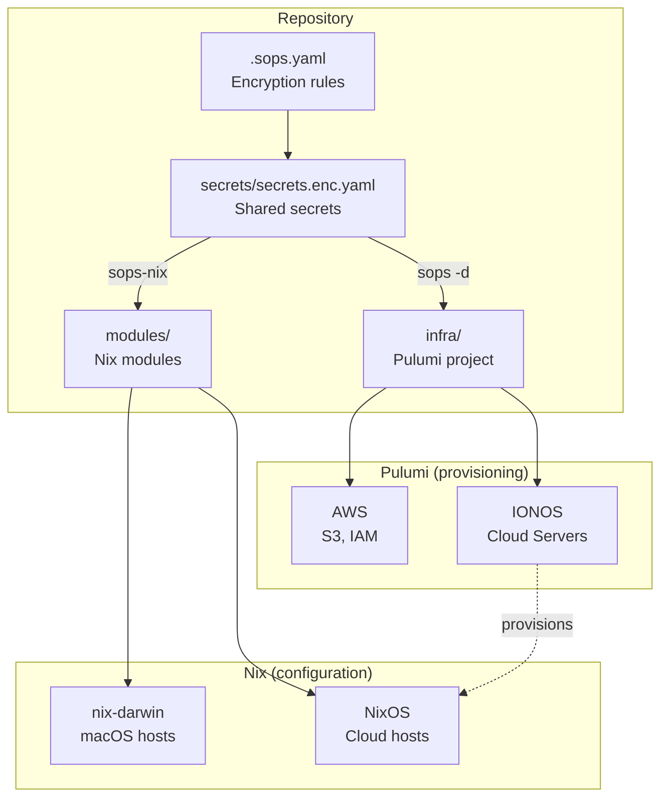
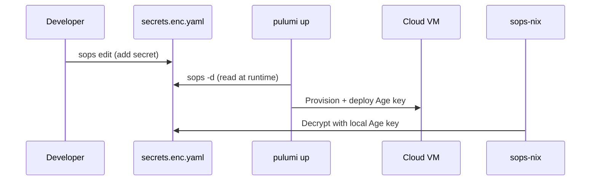
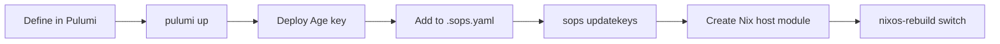

# Infrastructure (Pulumi + Nix)

Cloud infrastructure managed with [Pulumi](https://www.pulumi.com/) (TypeScript), deployed alongside [nix-darwin](https://github.com/LnL7/nix-darwin) host configurations. Secrets are shared between both systems via [SOPS](https://github.com/getsops/sops) with Age encryption.

## Architecture


```mermaid
graph TD
    subgraph Repository
        SOPS[".sops.yaml<br/>Encryption rules"]
        SEC["secrets/secrets.enc.yaml<br/>Shared secrets"]
        INFRA["infra/<br/>Pulumi project"]
        MODULES["modules/<br/>Nix modules"]
    end

    subgraph Pulumi["Pulumi (provisioning)"]
        AWS["AWS<br/>S3, IAM"]
        IONOS["IONOS<br/>Cloud Servers"]
    end

    subgraph Nix["Nix (configuration)"]
        DARWIN["nix-darwin<br/>macOS hosts"]
        NIXOS["NixOS<br/>Cloud hosts"]
    end

    SEC -->|sops -d| INFRA
    SEC -->|sops-nix| MODULES
    SOPS --> SEC
    INFRA --> AWS
    INFRA --> IONOS
    MODULES --> DARWIN
    MODULES --> NIXOS
    IONOS -.->|provisions| NIXOS
```

## Secret sharing

Pulumi and Nix share the same SOPS-encrypted secrets. No duplication, no syncing.


```mermaid
sequenceDiagram
    participant Dev as Developer
    participant SOPS as secrets.enc.yaml
    participant Pulumi as pulumi up
    participant VM as Cloud VM
    participant NixOS as sops-nix

    Dev->>SOPS: sops edit (add secret)
    Pulumi->>SOPS: sops -d (read at runtime)
    Pulumi->>VM: Provision + deploy Age key
    NixOS->>SOPS: Decrypt with local Age key
```

## Prerequisites

All tools are provided by the Nix devShell -- no manual installation needed:

```bash
# Enter the devShell (from the repo root)
nix develop
```

This gives you: `pulumi`, `node`, `pnpm`, `sops`.

You also need a [Pulumi Cloud](https://app.pulumi.com/) account for state
management. Auth is token-based: `pulumi_access_token` lives in
`secrets/infra.enc.yaml` and the `just pulumi` wrapper exports it — no
interactive `pulumi login`. The backend itself is pinned declaratively in
`Pulumi.yaml` (`backend.url`), which takes precedence over whatever
`~/.pulumi/credentials.json` has selected, so no per-machine login step exists.

Accepted trade-off worth knowing: on a successful cloud login the CLI still
caches that token into `~/.pulumi/credentials.json` in cleartext (mode 0600) —
`pulumi` writes the token unconditionally and only skips repointing `current`.
That copy is outside SOPS' control. Rotate via Pulumi Cloud if the file leaks.

No per-machine key setup is needed. `sops` decrypts with the SSH identity from
`SOPS_AGE_SSH_PRIVATE_KEY_FILE` (`modules/shells.nix` → `~/.ssh/id_ed25519_sops_nopw`),
so nothing is written to disk. That works only for files carrying an `ssh-ed25519`
recipient block — an age SSH identity cannot open `age1` blocks, not even the
`ssh-to-age` conversion of the very same key. `just pulumi` preflights this and, if a
file is missing its declared recipients, tells you to run `sops updatekeys <file>`.

## Quick start

Drive everything through `just pulumi …`. The wrapper compiles the TypeScript
program (`tsc` → `dist/`) and loads the Pulumi + Cloudflare tokens before each
call, so the program is never stale:

```bash
# 1. Install dependencies (once)
just pulumi-install

# 2. Check which stack you are pointed at (the stack already exists in Pulumi Cloud —
#    do NOT run `stack init`, that creates a second, empty one)
just pulumi stack ls

# 3. Preview changes
just pulumi preview

# 4. Apply changes
just pulumi up
```

Running `pulumi` directly (inside `nix develop`, from `infra/`) works too, but
you MUST `pnpm run build` first: the program's entrypoint is the compiled
`dist/index.js` (see `Pulumi.yaml`), so a stale or missing build would silently
run the wrong program against live resources.

## Commands

Prefer the **repo root** `just` recipes (they always rebuild and load tokens).
Running `pulumi` directly in `infra/` requires a prior `pnpm run build`:

| Command | Description |
|---|---|
| `just pulumi <args>` | Run any `pulumi` command with `PULUMI_ACCESS_TOKEN` loaded from `secrets/infra.enc.yaml` |
| `just pulumi-install` | Install Node.js dependencies |
| `just pulumi-preview` | Preview infrastructure changes |
| `just pulumi-up` | Apply infrastructure changes |
| `just pulumi-stack` | Show current stack state |
| `just infra-verify` | Check `src/inventory.ts` against the real machines (reachability + SSH host key) |
| `just infra-recon <target>` | Read-only survey of an unprovisioned host over SSH |
| `just cache-seed` | Seed the R2 binary cache with the current system's delta |
| `just cache-push <paths>` | Push specific store paths to the R2 cache (repair/ad hoc) |

`pulumi` operation secrets live in `secrets/infra.enc.yaml` (recipients: the
workstations that run Pulumi + recovery keys — see `.sops.yaml`). The `just
pulumi` wrapper decrypts them with `sops` and exports both
`PULUMI_ACCESS_TOKEN` and `CLOUDFLARE_API_TOKEN` into the environment for the
single command — the default Cloudflare provider (and the CLI `pulumi import`)
picks up `CLOUDFLARE_API_TOKEN` automatically. A named provider is deliberately
avoided so `pulumi import` records the bucket under the same (default) provider
the program declares it with.

## Project structure

```
infra/
  Pulumi.yaml          # Project config (runtime: nodejs/pnpm)
  Pulumi.prod.yaml     # Stack config (created by pulumi stack init)
  package.json         # Node.js dependencies
  tsconfig.json        # TypeScript config
  src/
    index.ts           # Main program — resource definitions
    helpers/
      sops.ts          # readSopsSecret() — SOPS-to-Pulumi bridge
```

## SOPS bridge

`readSopsSecret()` reads values from SOPS-encrypted YAML at Pulumi runtime and wraps them as `pulumi.secret()` so they never appear in plaintext in state or logs.

```typescript
import { readSopsSecret } from "./helpers/sops.js";

const apiKey = readSopsSecret("../secrets/secrets.enc.yaml", "my-api-key");
```

Requires the `sops` CLI and a valid Age key at `~/.ssh/id_ed25519_sops_nopw`.

## Cloudflare R2 binary cache

`src/index.ts` manages a Cloudflare R2 bucket (`nix-cache`) that both Darwin
hosts use as a shared Nix binary cache — build once on one Mac, substitute on
the other. It also manages the Cache Rule that makes the CDN in front of it
actually cache — see "Edge caching" below.

### The API token needs Cache Rules edit, and the failure is unhelpful

`cloudflare_api_token` was originally scoped "R2 admin + DNS edit". That is
enough to read the zone and manage the bucket and its custom domain, so
`pulumi preview` is perfectly happy — the write only fails at apply:

```
POST "https://api.cloudflare.com/client/v4/zones/<id>/rulesets": 403 Forbidden
{"success":false,"errors":[{"code":10000,"message":"Authentication error"}]}
```

"Authentication error" on a token that plainly authenticates for everything
else. Cache Rules live in the Rulesets API (`http_request_cache_settings`
phase) and need their own permission group: add **Zone → Cache Rules → Edit**
for `schwetschke.dev` to the token in the Cloudflare dashboard, then re-run
`just pulumi up`. Nothing in the repo needs changing.

### What ends up in the bucket, and why it is more than you expect

`nix-cache-push --seed` filters the closure against `cache.nixos.org` and hands
only the survivors to `nix copy` — on `ionos-vps` that is 203 paths out of 1140.
**The bucket still ends up holding most of the closure**, and that is correct
rather than a bug in the filter:

> a binary cache must be referentially complete. Every narinfo lists the path's
> references, and Nix refuses to write one whose references are absent at the
> destination:
>
> ```
> error: cannot add '/nix/store/…-etc' to the binary cache because the
>        reference '/nix/store/…-chfn.pam' is not valid
> ```
>
> `chfn.pam` is on `cache.nixos.org`, so the filter had dropped it — the paths
> the filter removes are exactly the ones the survivors point at.

So `--no-recursive` is a dead end (it produces that error), the filters choose
the *starting set* only, and `nix copy` uploads each survivor's closure minus
whatever R2 already has. Fixed-output paths above `NIX_CACHE_MAX_FOD_BYTES`
(default 10 MiB) are dropped too, which helps only for FODs nothing else
references — the 97 MB `index-x86_64-linux` is one.

Cost, so nobody re-litigates this from first principles: R2 is $0.015/GB-month
with 10 GB free, egress free, and operations far inside their free tiers. Both
host closures together are ~8 GB, i.e. **$0**. Growth is monotonic — nothing
here deletes — and a nixpkgs bump rewrites most store hashes, so the bucket does
creep. See "Garbage collection" below.

Clients must have `cache.nixos.org` configured *alongside* this one, which every
host here does, and `just bootstrap` too (`--extra-substituters` adds to the
defaults rather than replacing them).

### Is the hook actually pushing?

`/var/log/nix-cache-push.log` gets one line per hook invocation, successes
included — read it with `just cache-log`, or `just cache-log FAIL`:

```
…+0200 pid=91207 status=ok   exit=0 paths=3 dur=0s first=1ll6w1hah…-logprobe-…
…+0200 pid=96315 status=FAIL exit=1 paths=1 dur=0s first=a3ggbdma…-bitbucket-cli-0.18.2 err="… protocol mismatch …"
```

Successes are logged on purpose: an empty file then means *the hook is not
running*, rather than being indistinguishable from "everything worked". Before
this existed, a failed push left no trace anywhere and only surfaced weeks later
as a cache miss on the other Mac.

**An empty log right after a switch is expected**, and is not a failure: the
Determinate daemon reads the `post-build-hook` setting at startup and
`darwin-rebuild switch` does not restart it, so the new hook is inert until

```bash
sudo launchctl kickstart -k system/systems.determinate.nix-daemon
```

Rotation is handled by macOS' own `newsyslog` via `/etc/newsyslog.d/`, capped at
5 × 1 MB. Validate a rule change with `sudo newsyslog -n -v -f <file>` — the dry
run needs root even to parse.

### Garbage collection — and the trap in it

There is no automatic GC. On 2026-08-17 the bucket had grown to 22.34 GB /
16089 objects, of which 5073 paths belonged to no current host closure. Deleting
them freed 14.31 GB and brought it back under the free tier. Runtime was about
four minutes: ~10 s to list, ~2 min to resolve each narinfo to its nar, ~2 min to
delete in batches of 1000.

**It also broke 317 live paths, and the mechanism is worth knowing before anyone
tries this again.**

> A narinfo is named after the *store path* hash, but the nar it points at is
> named after the *content* hash — `nar/<content>.nar.zst`. Two store paths with
> identical contents therefore **share one nar file**, and that is common
> (wrappers, `.keep` files, generated completions).
>
> The GC deleted each stale narinfo together with "its" nar. For 317 of them the
> nar was also referenced by a *live* narinfo, which was left pointing at a file
> that no longer existed. Nix trusts the narinfo, fetches the nar, gets a 404 —
>
> ```
> warning: file 'nar/0qnimmcq….nar.zst' does not exist in binary cache
> ```
>
> — and falls back to building from source. A lying narinfo is strictly worse
> than a missing one: a missing path is a cache miss, a dangling one is a failure
> at the far end of a download.

So the rules for any repeat:

1. **Delete only what is in no current closure**, and enumerate *every* host
   first — a host you cannot reach is a host whose paths you are about to drop.
2. **Never delete a nar without checking that no surviving narinfo points at
   it.** Build the set of nars referenced by the narinfos you are keeping, and
   subtract it from the deletion set.
3. Afterwards, verify the invariant directly: every narinfo's `URL:` must exist
   as an object. The repair for a violation is to delete the *narinfo* — that
   restores honesty; the path is then simply absent and gets rebuilt or refetched.
4. Do not assume `cache.nixos.org` has a path because a `curl -sI` succeeded.
   Without `-f`, curl exits 0 on a 404. Packages built from this repo's overlays
   (`bitbucket-cli`, …) exist in **no** public cache — if R2 is their only copy,
   deleting it means a rebuild, and a rebuild can fail for unrelated reasons
   (GitHub answered 429 while this was being cleaned up).
5. **Invalidate Nix's narinfo lookup cache before re-uploading anything.** Nix
   remembers which paths a binary cache holds, in
   `~/.cache/nix/binary-cache-*.sqlite`, with a 30-day positive TTL
   (`narinfo-cache-positive-ttl`). Objects deleted through the S3 API are
   invisible to that memory, so `nix copy` skips them as "already present" and
   the repair does nothing while reporting success — the first re-seed here
   uploaded 5 paths where 291 were missing. Run the push with:

   ```bash
   NIX_CONFIG="narinfo-cache-positive-ttl = 0" just cache-seed
   ```

   Only for the repair run; the TTL is a worthwhile optimisation otherwise.

- **Bucket:** created by hand, **adopted** by Pulumi (not created):
  ```bash
  just pulumi import cloudflare:index/r2Bucket:R2Bucket nix-cache \
    '81e63dbf073ca45ebf67c430beac09a4/nix-cache/default'
  ```
- **Public URL:** a Pulumi-managed `R2CustomDomain`
  (`nix-cache.pub.schwetschke.dev`) — served through the Cloudflare CDN, no
  r2.dev rate limit. This is the `extra-substituters` entry in
  `modules/nix-cache.nix`.
- **Push:** signed `nix copy` to the S3 endpoint
  (`https://81e63dbf073ca45ebf67c430beac09a4.r2.cloudflarestorage.com`), either
  via the root `post-build-hook` or `just cache-seed`/`cache-push`.
- **Hook activation:** the Determinate `nix-daemon` reads `nix.custom.conf` only
  at startup and `darwin-rebuild switch` does not restart it, so after the first
  switch (or any change to `nix-cache-push`) the `post-build-hook` only becomes
  active once the daemon restarts:
  ```bash
  sudo launchctl kickstart -k system/systems.determinate.nix-daemon   # or reboot
  ```
  Substituter (pull) settings are read per client invocation and need no restart.
- **Fresh machine (disaster recovery):** the first `just switch` on a
  freshly installed Mac runs *before* `nix.custom.conf` exists, so R2 is not yet
  a substituter — and that first build is the most expensive one. Its ~3.3 GiB
  delta (the paths not on `cache.nixos.org`: nvf, llm-agents, yt-dlp, overlays …)
  would be compiled from source. Pre-fetch it from R2 first instead:
  ```bash
  just bootstrap <serial>          # e.g. DKL6GDJ7X1 — sudo; pulls the R2 delta into the store
  just switch-host <serial>        # then apply (everything is already local)
  ```
  `just bootstrap` runs `sudo nix build` with explicit `--extra-substituters` /
  `--extra-trusted-public-keys`: **root** is an always-trusted user, so the
  daemon honors them even before our `trusted-users` setting is applied — no
  `accept-flake-config`, no deployed config required. (The same R2 entry also
  sits in the flake's `nixConfig`, so a trusted user's ad-hoc `sudo nix build`
  of this flake reaches R2 too, subject to `accept-flake-config`.)

Secrets:

| Secret | File | Used by |
|---|---|---|
| `cloudflare_api_token` (R2 admin + `schwetschke.dev` **DNS edit** + **Cache Rules edit**) | `infra.enc.yaml` | Pulumi provider |
| `aws_access_key_id` / `aws_secret_access_key` (IAM user `pulumi-deploy`) | `infra.enc.yaml` | Pulumi AWS provider — **not** the work profile in `secrets.enc.yaml` |
| `r2_access_key_id` | `secrets.enc.yaml` | `nix copy` push (S3 access key id) |
| `r2_secret_access_key` — a Cloudflare API token (`cfat_…`); the push script derives its SHA-256 as the S3 secret. A ready-made 64-hex R2 secret is also accepted verbatim. | `secrets.enc.yaml` | `nix copy` push |
| `nix_cache_signing_key` | `secrets.enc.yaml` | NAR signing on push |

## AWS

Auth is a dedicated IAM user `pulumi-deploy` (account `155895292230`) with an
access key. Like the Pulumi and Cloudflare tokens, it lives in
`secrets/infra.enc.yaml` and the `just pulumi` wrapper exports it as
`AWS_ACCESS_KEY_ID` / `AWS_SECRET_ACCESS_KEY` for a single command — it is never
written to `~/.aws/credentials`. That matters here beyond tidiness: sops-nix
already writes an unrelated **work** profile to that file, so the wrapper also
unsets `AWS_PROFILE` / `AWS_DEFAULT_PROFILE` rather than trusting the SDK's
precedence rules to pick the right identity.

Region is stack config (`aws:region: eu-central-1` in `Pulumi.prod.yaml`), not an
environment variable.

Permissions: `AmazonS3FullAccess`, `AmazonVPCFullAccess`, `AWSLambda_FullAccess`,
`AmazonEC2ContainerRegistryFullAccess`, `CloudWatchLogsFullAccess`, plus one
customer-managed policy for the IAM subset Lambda needs. That last one is the
interesting one:

- role management (`iam:CreateRole` and friends) is scoped to
  `arn:aws:iam::155895292230:role/pulumi/*`, so **every `aws.iam.Role` this
  program declares must set `path: "/pulumi/"`** or `CreateRole` is denied;
- `iam:AttachRolePolicy` is conditioned on an allow-list of two Lambda execution
  policies, and `iam:PassRole` on `iam:PassedToService`;
- `iam:PutRolePolicy` is **deliberately absent**. An inline role policy can grant
  anything, so allowing it would make this user account-admin by a short detour:
  create a role, attach `AdministratorAccess`, pass it to Lambda. Use
  `RolePolicyAttachment` with the vetted managed policies instead. If arbitrary
  inline policies ever become necessary, add a **permissions boundary** required
  via a condition on `iam:CreateRole` — do not simply grant `PutRolePolicy`.

Known gap: `ec2:DescribeRegions` is not granted (`AmazonVPCFullAccess` does not
include it). The provider starts and imports without it; add it if a future
resource needs it.

### Adopted buckets

| Bucket | Access |
|---|---|
| `ufute8ee-public` | world-readable by design — inline bucket policy **and** a legacy `AllUsers` READ ACL, with no public-access-block to stop either |
| `uipecod1` | private — all four public-access-block settings on, `BucketOwnerEnforced` |

Both were adopted with `pulumi import` and carry `protect: true`. The code in
`src/index.ts` is verbatim generator output so `preview` stays at zero changes —
that zero-diff is the only evidence the adoption was faithful, so do not
hand-tidy properties there without checking the diff.

Neither bucket has versioning, and `ufute8ee-public` has no public-access-block.
Both are deliberate omissions, not oversights: hardening is a separate change
with its own blast radius, and folding it into the adoption would have destroyed
the zero-diff check.

### Not managed here

The account also contains `zombiestack` — a CloudFormation stack from
2016-10-31 with 13 `nodejs4.3` Lambda functions, left over from the AWS "Zombie
Apocalypse Workshop". It is not imported and not in scope; noted so the next
person who runs an account inventory does not mistake it for something this repo
provisions. Deleting it is a reasonable cleanup, independently of Pulumi.

## Hosts Pulumi cannot manage (`src/inventory.ts`)

Not every machine can be a resource. The IONOS VPS `p-ion-ber-xs56r6` lives in the
IONOS **Cloud Panel**, a different product family from IONOS Cloud / DCD, with a
different API — and this tariff cannot issue an API key for it at all. There is no
provider and no endpoint, so `pulumi import` is not an option. The full evidence is
in [`Architecture.md` §11](./Architecture.md#11-the-ionos-vps-is-out-of-pulumis-reach--and-why);
read it before adding an IONOS provider in the hope of adopting this server.

It is recorded anyway, as hand-maintained constants in `src/inventory.ts` exported as
a stack output, so the host appears in the inventory that `Architecture.md` §6 defines
as the Pulumi→Nix contract rather than living only in a browser tab.

Because Pulumi reconciles nothing here, the drift check is separate and must be run
deliberately:

```bash
just infra-verify          # both addresses reachable, Ed25519 host key as recorded
```

It fails on a key mismatch (reinstall, renumbering, interception) **and** on an
unreachable host — silence is never treated as success. The recorded key doubles as
`known_hosts` material for pinning host keys instead of `accept-new`.

To decide how deeply Nix can manage such a host — `system-manager` on the existing
distro versus a full NixOS conversion via `nixos-anywhere` — survey it first:

```bash
just infra-recon root@87.106.149.208 > /tmp/ionos-recon.txt
```

That changes nothing on the target. A NixOS conversion, if chosen, needs both
recovery paths confirmed beforehand: the Cloud Panel's KVM remote console with
bootable rescue media, and a server Image taken before the install.

## Adding a new cloud host


```mermaid
graph LR
    A[Define in Pulumi] --> B[pulumi up]
    B --> C[Deploy Age key]
    C --> D[Add to .sops.yaml]
    D --> E[sops updatekeys]
    E --> F[Create Nix host module]
    F --> G[nixos-rebuild switch]
```

1. Add the server resource in `src/index.ts`
2. Run `just pulumi up` to provision
3. Deploy the SOPS Age key to the new machine
4. Add the host's Age public key to `../.sops.yaml`
5. Re-encrypt host secrets: `sops updatekeys ../hosts/<host>/secrets.enc.yaml`
6. Create a Nix host module at `../modules/hosts/<host>.nix`
7. Deploy NixOS configuration
