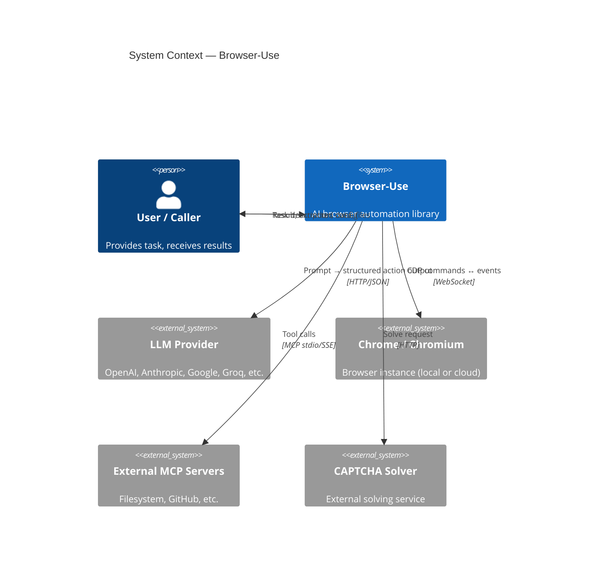
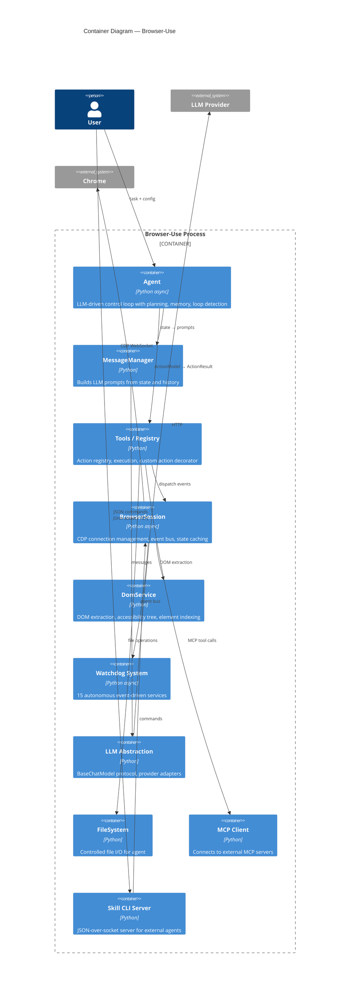
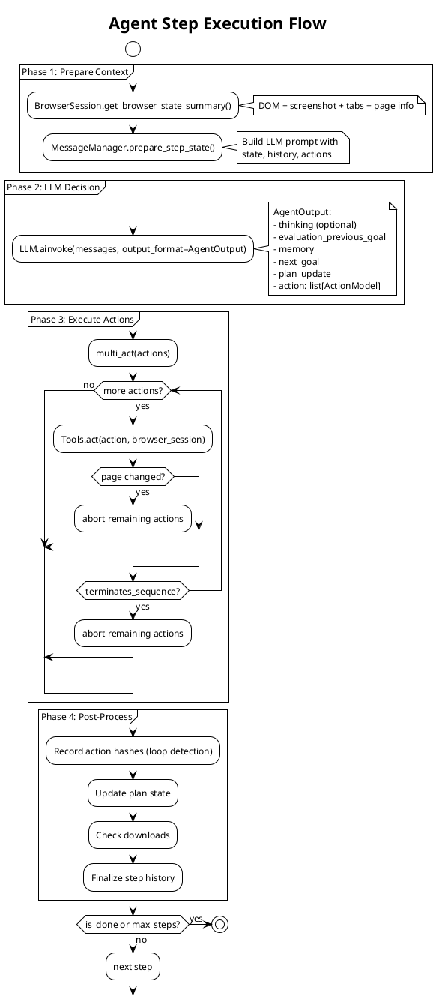
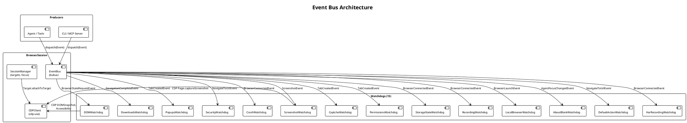
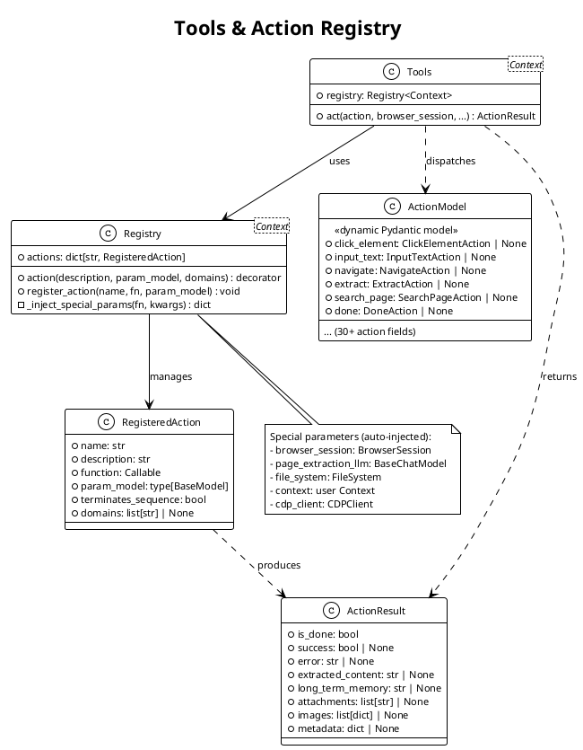
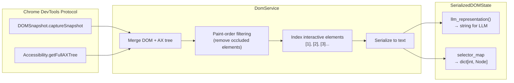
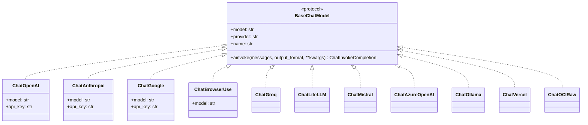
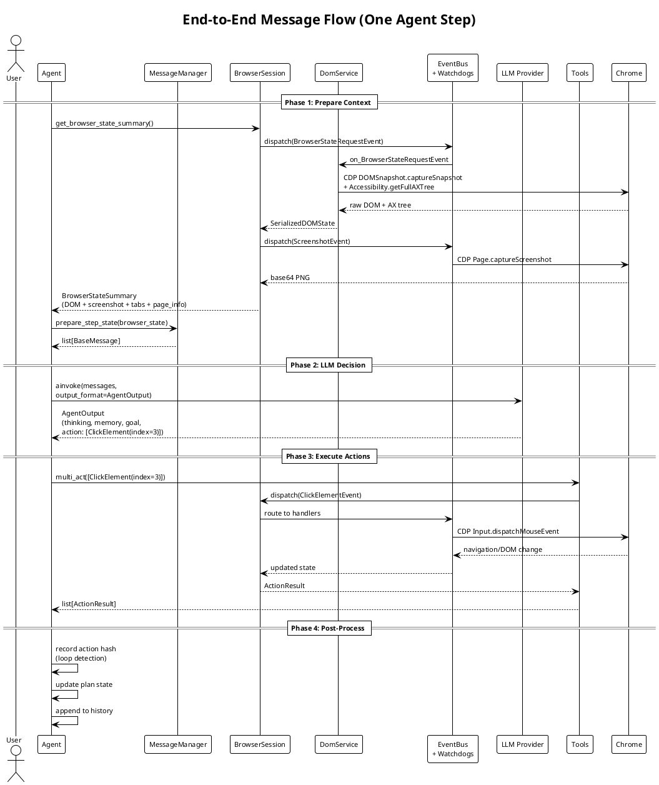
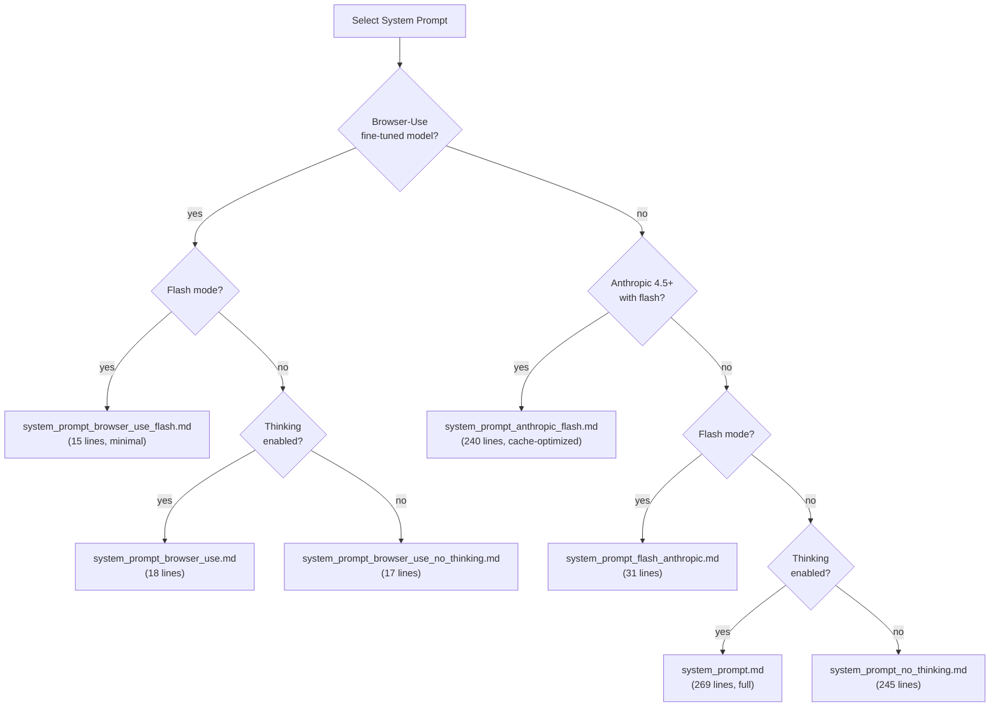

# Browser-Use Architecture

This document describes the architecture of browser-use following the
[C4 model](https://c4model.com/): Context, Containers, Components, and Code.

## Level 1: System Context

Browser-use is an async Python library that enables AI agents to autonomously
operate web browsers. It sits between an LLM provider and a Chrome browser,
translating high-level goals into sequences of browser actions.



### External Actors

| Actor | Role | Protocol |
|-------|------|----------|
| **User / Caller** | Provides task via Python API, CLI, or MCP | Python async / JSON-RPC / Unix socket |
| **LLM Provider** | Decides next action given browser state | HTTP (provider-specific SDK) |
| **Chrome / Chromium** | Renders pages, executes JS | CDP over WebSocket |
| **External MCP Servers** | Extend agent capabilities (filesystem, APIs) | MCP stdio/SSE |
| **CAPTCHA Solver** | Solves CAPTCHAs detected by watchdog | HTTP |

## Level 2: Container Diagram

Browser-use runs as a single Python process with several logical containers.



## Level 3: Component Diagram

### 3.1 Agent Subsystem

The Agent is the main orchestrator. Each `step()` call goes through four phases.



**Key Agent components:**

| Component | File | Responsibility |
|-----------|------|----------------|
| `Agent` | `agent/service.py` | Main loop: step → prepare → LLM → execute → post-process |
| `AgentState` | `agent/views.py` | Step count, failure count, last output, loop detector |
| `AgentSettings` | `agent/views.py` | Config: vision, thinking, flash mode, planning, timeouts |
| `ActionLoopDetector` | `agent/views.py` | Hashes recent actions, detects repetition, suggests alternatives |
| `MessageManager` | `agent/message_manager/service.py` | Prompt building, history compaction, sensitive data masking |
| `SystemPrompt` | `agent/prompts.py` | Model-specific prompt selection (9 variants) |

### 3.2 Browser Session & Event Bus

BrowserSession is the central nervous system. All browser operations flow
through an event bus (`bubus`), enabling loose coupling between components.



**Watchdog responsibilities:**

| Watchdog | Listens To | Purpose |
|----------|-----------|---------|
| **DOMWatchdog** | BrowserStateRequestEvent | Extracts DOM tree via DomService, builds `SerializedDOMState` |
| **DownloadsWatchdog** | NavigationCompleteEvent, TabCreatedEvent | Intercepts PDF downloads, tracks file paths |
| **PopupsWatchdog** | TabCreatedEvent | Auto-dismisses JavaScript dialogs (alert, confirm, prompt) |
| **SecurityWatchdog** | NavigateToUrlEvent, NavigationCompleteEvent | Enforces `allowed_domains` / `prohibited_domains` |
| **CrashWatchdog** | BrowserConnectedEvent, TabCreatedEvent | Detects target crashes, network timeouts |
| **ScreenshotWatchdog** | ScreenshotEvent | Captures screenshots via CDP |
| **CaptchaWatchdog** | TabCreatedEvent | Detects CAPTCHAs, blocks agent or invokes solver |
| **PermissionsWatchdog** | TabCreatedEvent | Auto-grants browser permissions (geolocation, camera) |
| **StorageStateWatchdog** | BrowserConnectedEvent, BrowserStopEvent | Persists and restores cookies/localStorage |
| **RecordingWatchdog** | BrowserConnectedEvent, BrowserStopEvent | Records video for debugging |
| **HarRecordingWatchdog** | BrowserConnectedEvent, BrowserStopEvent | Records HTTP Archive |
| **LocalBrowserWatchdog** | BrowserLaunchEvent, BrowserStopEvent | Manages local Chrome process lifecycle |
| **AboutBlankWatchdog** | AgentFocusChangedEvent | Handles empty tab states |
| **DefaultActionWatchdog** | NavigateToUrlEvent, BrowserStateRequestEvent | Injects per-domain defaults (cookies, localStorage) |

### 3.3 Tools & Action Registry

The action registry uses a decorator pattern to register functions as agent
actions. Special parameters (e.g., `browser_session`) are auto-injected.



**Built-in actions** (registered in `tools/service.py`):

| Category | Actions |
|----------|---------|
| **Navigation** | `navigate`, `go_back`, `search` (web), `switch_tab`, `close_tab` |
| **Interaction** | `click_element`, `input_text`, `select_dropdown`, `send_keys`, `upload_file` |
| **Reading** | `extract` (LLM-powered), `search_page` (regex/text), `find_elements` (CSS), `get_dropdown_options` |
| **Utility** | `screenshot`, `save_as_pdf`, `scroll`, `done` |

### 3.4 DOM Processing Pipeline

The DOM service transforms raw CDP snapshots into a token-efficient
representation for the LLM.



**LLM representation format:**

```
[1]<a href="/products">Products</a>
[2]<input type="search" placeholder="Search..." value=""/>
[3]<button type="submit">Go</button>
[4]<div role="navigation">
  [5]<a href="/about">About Us</a>
  [6]<a href="/contact">Contact</a>
</div>
```

Key processing steps:

1. **Fetch** DOM snapshot and accessibility tree via CDP
2. **Merge** AX tree nodes with DOM nodes (adds roles, names, ARIA attributes)
3. **Filter** occluded elements via paint-order analysis
4. **Traverse** iframes and shadow DOM (configurable: `max_iframes`, `max_iframe_depth`)
5. **Index** interactive/visible elements with sequential integers
6. **Serialize** to indented text with tag names, selected attributes, and text content

### 3.5 LLM Abstraction

All LLM providers implement the `BaseChatModel` protocol.



The `ainvoke` method accepts `list[BaseMessage]` and an optional `output_format`
(a Pydantic model class). It returns `ChatInvokeCompletion[T]` containing the
parsed response plus usage statistics.

### 3.6 Message Flow Through the System



## Level 4: Key Data Structures (Code)

### AgentOutput — What the LLM Returns

```python
class AgentOutput(BaseModel):
    thinking: str | None = None              # Extended reasoning (thinking models)
    evaluation_previous_goal: str | None     # Did the last action work?
    memory: str | None = None                # Accumulated knowledge
    next_goal: str | None = None             # What to do next
    current_plan_item: int | None = None     # Active plan step index
    plan_update: list[str] | None = None     # Revised plan
    action: list[ActionModel]                # 1+ actions to execute
```

### BrowserStateSummary — What the Agent Sees

```python
@dataclass
class BrowserStateSummary:
    dom_state: SerializedDOMState    # Processed DOM with element indices
    url: str                         # Current page URL
    title: str                       # Page title
    tabs: list[TabInfo]              # All open tabs
    screenshot: str | None           # Base64-encoded PNG
    page_info: PageInfo | None       # Viewport, page size, scroll position
    pixels_above: int                # Content above viewport
    pixels_below: int                # Content below viewport
    browser_errors: list[str]        # Recent errors
    pending_network_requests: list[NetworkRequest]
    pagination_buttons: list[PaginationButton]
    closed_popup_messages: list[str] # Auto-dismissed dialog messages
```

### ActionResult — What Actions Return

```python
class ActionResult(BaseModel):
    is_done: bool | None = False
    success: bool | None = None          # Only set when is_done=True
    error: str | None = None
    extracted_content: str | None = None  # Data from the page
    long_term_memory: str | None = None   # Always kept in LLM context
    attachments: list[str] | None = None  # File paths
    images: list[dict] | None = None      # Base64 images
    metadata: dict | None = None
```

### SerializedDOMState — The LLM's View of the Page

```python
@dataclass
class SerializedDOMState:
    selector_map: dict[int, EnhancedDOMTreeNode]  # index → node

    def llm_representation(
        self,
        include_attributes: list[str] | None = None,
    ) -> str:
        """Token-efficient text representation of the DOM for LLM consumption."""
        ...
```

Default included attributes: `title`, `type`, `checked`, `id`, `name`, `role`,
`value`, `placeholder`, `alt`, `aria-label`, `aria-expanded`, `data-state`,
`aria-checked`, `contenteditable`, `disabled`, `required`, `ax_name`, and more.

## System Prompt Selection

The agent selects from 8 system prompt variants based on model capabilities:



## Configuration & Environment

Configuration is loaded from environment variables and an optional JSON config
file (`~/.config/browser-use/config.json`).

**Key environment variables:**

| Variable | Default | Purpose |
|----------|---------|---------|
| `BROWSER_USE_LOGGING_LEVEL` | `info` | Log verbosity: debug, info, result |
| `BROWSER_USE_HEADLESS` | `false` | Run browser without GUI |
| `BROWSER_USE_ALLOWED_DOMAINS` | — | Comma-separated domain whitelist |
| `BROWSER_USE_PROXY_URL` | — | HTTP/SOCKS proxy URL |
| `BROWSER_USE_API_KEY` | — | Browser-Use cloud API key |
| `BROWSER_USE_CALCULATE_COST` | `false` | Enable token cost tracking |
| `OPENAI_API_KEY` | — | OpenAI provider key |
| `ANTHROPIC_API_KEY` | — | Anthropic provider key |
| `GOOGLE_API_KEY` | — | Google Gemini provider key |

## File Organization

```
browser_use/
├── agent/
│   ├── service.py                 # Agent class (main loop, step, multi_act)
│   ├── views.py                   # AgentState, AgentSettings, ActionLoopDetector
│   ├── prompts.py                 # SystemPrompt selection logic
│   ├── judge.py                   # Trace validation / judging
│   ├── system_prompts/            # 8 markdown prompt variants
│   └── message_manager/
│       ├── service.py             # MessageManager (prompt building, compaction)
│       └── views.py               # HistoryItem, MessageManagerState
│
├── browser/
│   ├── session.py                 # BrowserSession, Target, CDPSession management
│   ├── events.py                  # 50+ event definitions (Pydantic + bubus)
│   ├── views.py                   # BrowserStateSummary, TabInfo, PageInfo
│   ├── profile.py                 # BrowserProfile, display detection, extensions
│   ├── watchdog_base.py           # BaseWatchdog (auto handler discovery)
│   └── watchdogs/                 # 15 watchdog implementations
│       ├── dom_watchdog.py
│       ├── downloads_watchdog.py
│       ├── popups_watchdog.py
│       ├── security_watchdog.py
│       ├── crash_watchdog.py
│       ├── screenshot_watchdog.py
│       ├── captcha_watchdog.py
│       ├── permissions_watchdog.py
│       ├── storage_state_watchdog.py
│       ├── recording_watchdog.py
│       ├── har_recording_watchdog.py
│       ├── local_browser_watchdog.py
│       ├── about_blank_watchdog.py
│       └── default_action_watchdog.py
│
├── dom/
│   ├── service.py                 # DomService (DOM extraction + AX tree merge)
│   ├── views.py                   # SerializedDOMState, EnhancedDOMTreeNode
│   └── enhanced_snapshot.py       # CDP snapshot building
│
├── tools/
│   ├── service.py                 # Tools class (action execution)
│   ├── views.py                   # Action parameter models (30+ Pydantic classes)
│   └── registry/
│       ├── service.py             # Registry (action registration, DI)
│       └── views.py               # RegisteredAction, ActionModel (dynamic)
│
├── llm/
│   ├── base.py                    # BaseChatModel protocol
│   ├── messages.py                # BaseMessage, SystemMessage, UserMessage
│   ├── openai/chat.py             # ChatOpenAI
│   ├── anthropic/chat.py          # ChatAnthropic
│   ├── google/chat.py             # ChatGoogle
│   ├── browser_use/chat.py        # ChatBrowserUse (fine-tuned)
│   └── ...                        # Groq, LiteLLM, Mistral, Azure, Ollama, etc.
│
├── mcp/
│   ├── server.py                  # MCP server mode (expose tools to clients)
│   ├── client.py                  # MCPClient (connect to external servers)
│   └── controller.py              # MCPToolWrapper (register MCP tools as actions)
│
├── skill_cli/
│   ├── main.py                    # CLI entry point, argument parsing
│   ├── server.py                  # Session server (Unix socket / TCP)
│   ├── protocol.py                # JSON wire protocol (Request/Response)
│   ├── sessions.py                # SessionRegistry, session lifecycle
│   └── commands/                  # Command handlers (browser, agent, python, etc.)
│
├── code_use/
│   ├── service.py                 # CodeAgent (Jupyter-like code execution)
│   ├── views.py                   # CodeCell, NotebookSession
│   └── system_prompt.md           # CodeAgent prompt (575 lines)
│
├── filesystem/
│   └── file_system.py             # FileSystem (controlled file I/O)
│
├── skills/
│   └── service.py                 # SkillService (fetch/execute cloud skills)
│
├── tokens/
│   ├── service.py                 # TokenCost (usage tracking, cost calculation)
│   └── views.py                   # TokenUsageEntry, ModelPricing, UsageSummary
│
├── config.py                      # Config singleton, env vars, DB-style config
├── logging_config.py              # Logging setup, FIFO pipe handlers
└── __init__.py                    # Lazy imports, public API (30+ exports)
```

## Architectural Patterns

### Event-Driven Coordination

All browser operations flow through a `bubus` EventBus. Watchdogs subscribe
to events by naming convention (`on_EventName` methods on `BaseWatchdog`
subclasses). This enables loose coupling — watchdogs do not call each other
directly and can be enabled/disabled independently.

### Action Registry with Dependency Injection

The `@tools.registry.action()` decorator registers async functions as agent
actions. The registry inspects function signatures and auto-injects special
parameters (`browser_session`, `page_extraction_llm`, `file_system`, `context`,
`cdp_client`) at call time. This keeps action implementations clean — they
declare what they need, and the registry provides it.

### Multi-Action Sequencing Guards

When the LLM requests multiple actions per step, `multi_act()` protects
against stale DOM references with two layers:

1. **Static metadata**: Actions marked `terminates_sequence=True` (e.g.,
   `navigate`) abort the remaining action queue.
2. **Runtime detection**: After each action, the URL and focused CDP target are
   compared to pre-action values. If either changed, remaining actions are
   discarded.

### Progressive System Prompts

System prompts are selected based on model capabilities (thinking support,
flash mode, provider-specific optimizations). Browser-use fine-tuned models
get minimal prompts (15-18 lines); general models get full prompts (240-269
lines) with detailed interaction rules.

### Pydantic Models as Contracts

All data boundaries use Pydantic v2 models with `ConfigDict(extra='forbid')`.
This provides runtime validation, JSON schema generation for LLM function
calling, and type safety throughout the codebase.
