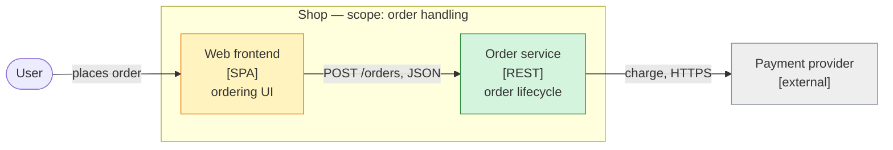

# Grobdesign

A Grobdesign answers three questions and nothing else:

1. **Functional placement:** which component is responsible for what?
2. **Interfaces:** what do the technical contracts between them look like?
3. **Flows:** where does data go, and where does the activity come from?

It sits between a requirement and the implementation.
It is short, mostly diagrams and tables, and readable in ten minutes.
Class and method design, configuration and step-by-step implementation do not belong here.

> **Write the prose with `Skill(technical-writing)`, and render every diagram
> with `Skill(diagram-renderer)` before you hand the document over.** A
> Grobdesign is read to decide whether the approach is sound, so it starts with
> a TL;DR. A diagram that does not render counts as not delivered.
> Match the language of the surrounding documentation (German or English).

Start from `references/template.md`. Delete every chapter that has nothing to say.

## Structure (arc42-light)

Every chapter is optional. A chapter without content is **removed**, not filled with "n/a".

| # | Chapter | arc42 | Content |
|---|---|---|---|
| 0 | TL;DR, goals, non-goals | §1 | 1–3 sentences: what and why. What is explicitly out of scope. |
| 1 | Context and scope | §3 | C4 level 1 diagram; who and what is outside the system. |
| 2 | Functional placement | §5 | C4 level 2/3 diagrams; responsibility table. |
| 3 | Interfaces | §3, §5 | One profile per interface. |
| 4 | Flows | §6 | One diagram per relevant flow, with trigger and direction. |
| 5 | Cross-cutting and NFRs | §8, §10 | Only deviations from the norm. |
| 6 | Decisions | §9 | Links to ADRs (`Skill(adr-writing)`); no decision essays here. |
| 7 | Risks and open questions | §11 | What is unclear, who clarifies it. |

## Functional placement

"Component" depends on the level you design at.
**Name the level first**, then place responsibilities on it:

- domain / bounded context
- microservice or deployable
- module or package
- class, or type class / interface

Do not mix levels in one diagram.
A service and a class in the same box-and-arrow picture means the zoom level is wrong.

Per component, state **one** responsibility, and what it is deliberately *not* responsible for:

| Component | Level | Responsible for | Deliberately not | Status |
|---|---|---|---|---|
| Order service | microservice | order lifecycle, price snapshot | payment, stock | changed |

Status is `new`, `changed` or `unchanged`.
It shows the reader at once where work happens.
If you cannot state the responsibility in one sentence, the cut is wrong.

## Interfaces

One profile per interface, as a table.
No full schema; only what a reader needs to judge the design.

| Field | Content |
|---|---|
| Provider → consumer | who offers, who calls |
| Technology / standard | REST + OpenAPI, gRPC, AsyncAPI/Kafka, JDBC, file drop, … |
| Change | new / changed (breaking?) / unchanged |
| Versioning | how consumers migrate |
| Non-functional | latency, throughput, availability, idempotency, ordering, authN/authZ, data protection |

State what must change on **both** sides. An interface change with an unnamed consumer is a defect.

## Flows

**Data flow and activity flow are two different things. Name both.**

- *Data flow:* which way the payload moves.
- *Activity flow:* who becomes active, and what triggers it — external request, timer, event, user, polling.

Same direction means push: the sender is active and the data follows it.
Opposite directions mean pull, for example polling: the receiver is active, the data flows back to it.

Per flow, state:

1. **Trigger** — where the activity comes from (never "the system").
2. **Data direction** and **activity direction** — same or opposite.
3. **Synchronous or asynchronous**, and what happens on failure or timeout.

Notation in flowcharts: solid arrow = data, dashed arrow = "activates".
In sequence diagrams the trigger is the first participant.

## Diagrams: C4 zoom levels

Follow C4. Provide several zoom levels rather than one picture with everything on it.

| Level | Shows | Draw when |
|---|---|---|
| L1 Context | the system, its users and neighbouring systems | always, unless trivial |
| L2 Container | deployables, data stores, their protocols | several deployables involved |
| L3 Component | components inside one container | one container carries the change |
| L4 Code | classes | almost never; leave it out |

Rules:

- Draw only levels that show something the level above does not.
- Every diagram has a title, a legend and a stated scope (what is inside the frame).
- Every arrow carries a label: what flows, over which protocol.
- Mark `new` / `changed` / `external` with `classDef`.
- The higher level names the lower one, so the reader can zoom in.

**Mermaid as flowchart.**
Use `flowchart` with C4 conventions: subgraph = system boundary,
node text = `Name [technology] task`.
Mermaid's native `C4Context` / `C4Container` types are experimental and lay out poorly;
use them only when the reader explicitly wants the C4 look.
Use `sequenceDiagram` for flows.
Use PlantUML (C4-PlantUML) only if the project already does.

Legend: green = new, yellow = changed, grey = external.

## Anti-patterns

- Full API schemas or class diagrams down to method level.
- One overview diagram for every zoom level.
- Arrows without a label.
- Data direction and trigger merged into one arrow, so polling looks like push.
- A trigger called "the system" or "someone".
- "Service X handles everything about Y": a responsibility without a boundary.
- Decision reasoning inside the Grobdesign instead of a linked ADR.
- Chapters filled with "n/a" or "tbd" placeholders.

## Related skills

- **`technical-writing`**: TL;DR first, German and English. Load it before you write.
- **`diagram-renderer`**: renders the Mermaid blocks; run it on the finished file.
- **`adr-writing`**: for each significant decision that the Grobdesign surfaces.
