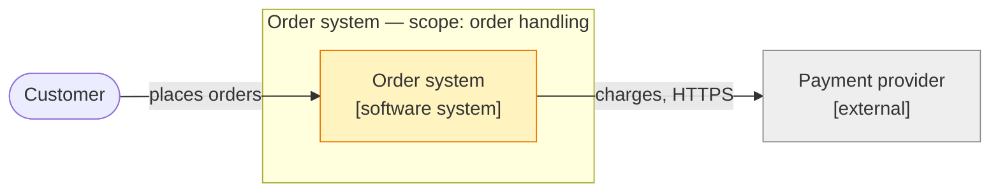
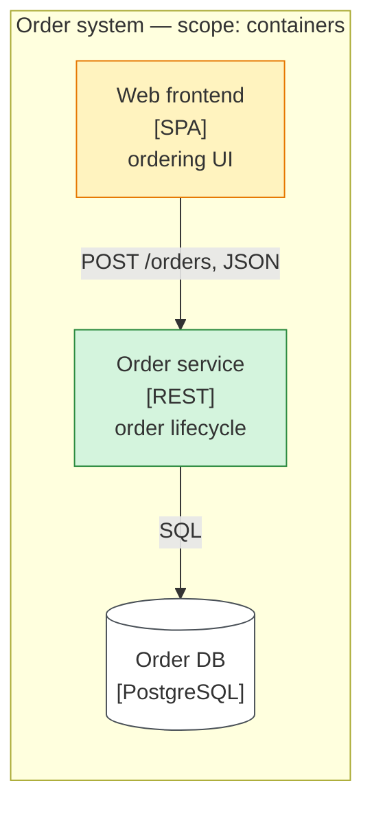
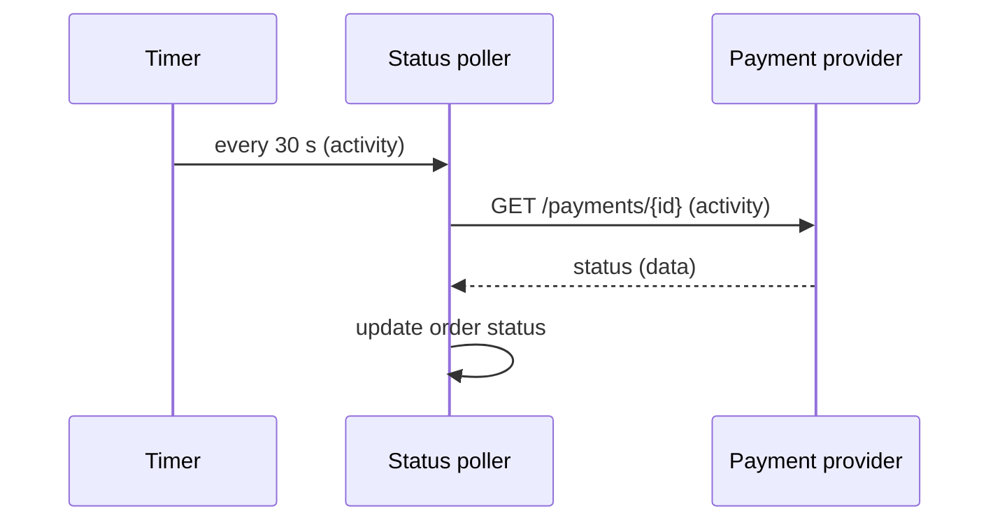

# Grobdesign: <Title>

<!-- Delete every chapter without content. Fictional names only in examples. -->

**TL;DR:** <What changes and why, in one to three sentences.>

**Goals:** <...>
**Non-goals:** <...>

## 1 Context and scope (C4 L1)

Scope: <what is inside the frame>.

Legend: green = new, yellow = changed, grey = external.

## 2 Functional placement (C4 L2/L3)

Level: <domain | microservice | module | class | type class>.
Scope: <what is inside the frame>.

| Component | Level | Responsible for | Deliberately not | Status |
|---|---|---|---|---|
| Order service | microservice | order lifecycle | payment | new |

## 3 Interfaces

### <Provider> → <Consumer>

| Field | Content |
|---|---|
| Technology / standard | <REST + OpenAPI \| gRPC \| AsyncAPI/Kafka \| ...> |
| Change | <new \| changed (breaking?) \| unchanged> |
| Versioning | <...> |
| Non-functional | <latency, throughput, availability, idempotency, ordering, authN/authZ, data protection> |
| Must change on both sides | <provider: ...; consumer: ...> |

## 4 Flows

### <Flow name>

- **Trigger:** <external request | timer | event | user | polling>
- **Data direction:** <A → B>
- **Activity direction:** <same | opposite: B asks A>
- **Sync / async, failure behaviour:** <...>

Polling example: activity goes from the poller to the source, data comes back.

## 5 Cross-cutting and NFRs

<Only deviations from the norm.>

## 6 Decisions

- <Link to ADR>

## 7 Risks and open questions

- <Question — who clarifies it>
