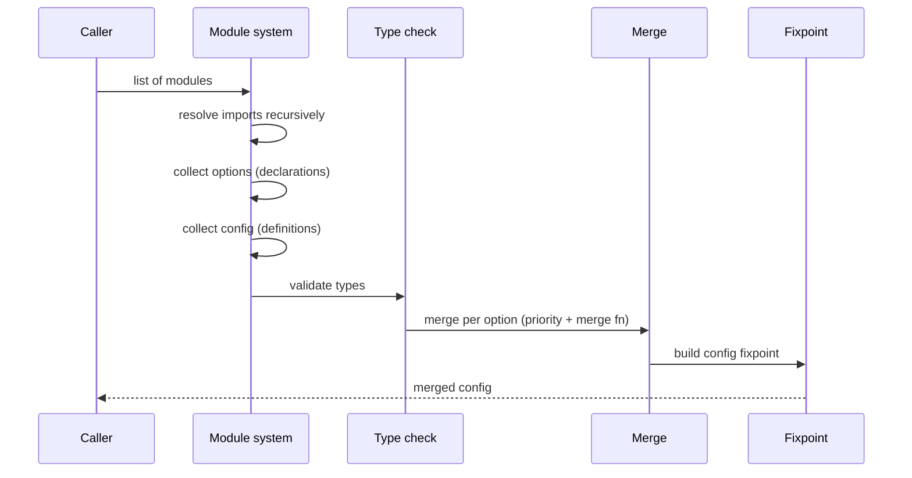
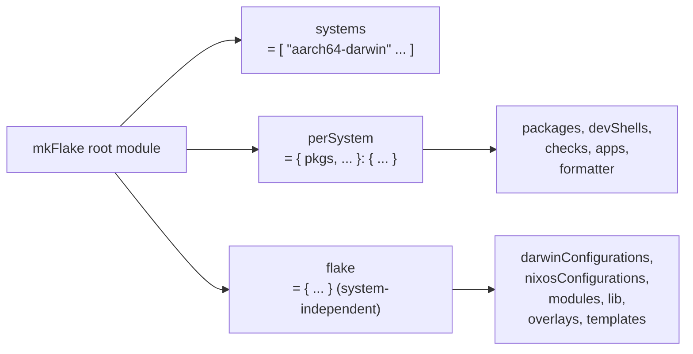

# Foundations: Module System and flake-parts

Background reading for the Dendritic Pattern.
The main `SKILL.md` assumes you already know this material.
Load this reference when you don't,
or when a question turns on the precise semantics
of options, merging, or flake-parts evaluation.

## Vocabulary

| Term | Meaning |
|---|---|
| **Flake** | Directory with a `flake.nix` declaring `inputs` and `outputs`. Locked via `flake.lock` for reproducibility. |
| **Output** | Anything a flake exports: `packages.<system>.<name>`, `nixosConfigurations.<host>`, `darwinConfigurations.<host>`, `devShells`, `nixosModules`, `lib`, `overlays`, `templates`, `checks`, `apps`, `formatter`. |
| **Module** | A function `{ config, lib, options, pkgs, ... }: { imports = []; options = {}; config = {}; }`. The data shape consumed by the module system. |
| **Module system** | The evaluation machinery in `nixpkgs/lib/modules.nix`. Takes a list of modules, resolves a fixpoint, type-checks, merges definitions, returns a final `config`. |
| **Option** | A typed *declaration* (`mkOption`) of a configuration field. |
| **Definition** | A *value* assigned to an option. Definitions for one option may be split across many modules. |
| **`flake-parts`** | Library that applies the module system to the *flake itself*, so flake outputs can be composed modularly. |

The two most important distinctions:

- *Flake-level* and *system-level* (NixOS / home-manager / nix-darwin)
  are **two separate fixpoints** of the same module-system machinery.
  Values cross between them only through explicit bridges
  (`flake.modules.<class>.<aspect>`, `specialArgs`, `withSystem`).
- An **option** is a typed promise of a field;
  a **definition** is the value supplied for it.
  Every `option 'X' used but not defined` error is a missing `mkOption`.

## The Module System

### Anatomy of a module

```nix
{ config, lib, pkgs, ... }: {
  imports = [
    ./other-module.nix
  ];

  options.my.cursor.size = lib.mkOption {
    type = lib.types.int;
    default = 32;
  };

  config = {
    environment.variables.CURSOR_SIZE = toString config.my.cursor.size;
  };
}
```

Three fields, three jobs:

| Field | Purpose |
|---|---|
| `imports` | Pull in other modules. Imports are transitive. |
| `options` | Declare schemas (`mkOption`). |
| `config` | Assign values (definitions). |

**Shorthand**: a module with *only* a `config` field may omit the
`config = { ... };` wrapper — top-level keys are then implicit definitions.
As soon as `options` or `imports` appear, `config` must be explicit,
or the module system errors.

### `mkOption` fields

| Field | Purpose |
|---|---|
| `type` | Validation **and** merge strategy. The most consequential field. |
| `default` | Value used when no module defines the option. Implicit priority 1500. |
| `example` | Documentation only; not type-checked. |
| `description` | CommonMark documentation. |
| `defaultText` | Override how the default renders in the manual (use `lib.literalExpression`). |
| `apply` | Post-merge transformation. Use sparingly — `config.foo` no longer equals the supplied input. |
| `visible` | Set to `false` to hide from generated documentation. |
| `readOnly` | When `true`, definitions are forbidden. |
| `internal` | Implementation detail; hides from docs and downstream consumers. |

### Type catalogue and merge behaviour

| Type | Conflict behaviour |
|---|---|
| `int`, `str`, `bool`, `path`, `package`, `enum [ ... ]` | Error |
| `nullOr T` | Like `T`; `null` counts as undefined |
| `listOf T` | Concatenate (order not guaranteed) |
| `attrsOf T` | Recursive merge per key |
| `submodule { options = { ... }; }` | Recursive module-style merge |
| `attrsOf (submodule { ... })` | Standard idiom for "named instances of a thing" |
| `lines` | Line-wise concatenation |
| `oneOf [ T1 T2 ]` | First matching type wins |
| `deferredModule` | Stores a module value without evaluating it; merges via standard module merge |
| `anything` | Last resort; no merge |

Rule of thumb: **`attrsOf (submodule { ... })`** is the right shape
whenever you want "many named instances of a thing" — hosts, users,
services. It is exactly the shape `flake.modules` itself uses
(`lazyAttrsOf (lazyAttrsOf deferredModule)`,
keyed by configuration class, then by aspect name).

### Evaluation phases



`config` is visible *everywhere* in the fixpoint —
including inside the module that declares an option.
This is what lets aspect modules read each other's values
without caring about evaluation order.

### Priorities

Lower number wins.

| Helper | Priority |
|---|---|
| `mkVMOverride` | 10 |
| `mkForce` | 50 |
| `mkImageMediaOverride` | 60 |
| `mkOverride n` | n |
| *(unmodified)* | 100 |
| `mkDefault` | 1000 |
| `mkOptionDefault` (implicit from `mkOption`'s `default`) | 1500 |

Equal priority falls through to the type's merge function.
For non-mergeable types (`int`, `str`, `bool`) equal priority is an error:
`The option 'foo' is defined multiple times`.

```nix
config.my.cursor.size = 32;                   # priority 100
config.my.cursor.size = lib.mkDefault 16;     # priority 1000 — loses
config.my.cursor.size = lib.mkForce 48;       # priority 50  — wins
```

### `mkIf` and `mkMerge`

```nix
{ config, lib, ... }: {
  config = lib.mkMerge [
    { services.nginx.enable = true; }

    (lib.mkIf config.services.nginx.enable {
      networking.firewall.allowedTCPPorts = [ 80 443 ];
    })

    (lib.mkIf (config.networking.hostName == "laptop") {
      services.tlp.enable = true;
    })
  ];
}
```

`mkIf false` removes the entire branch from the merge —
it is **not** the same as setting an empty value.
This matters for options that have no meaningful empty state.

## flake-parts

### The three top-level options



- **`systems`** — which architectures to build for.
  `perSystem` is evaluated once per entry.
- **`perSystem = { config, self', inputs', system, pkgs, ... }: { ... }`** —
  everything that varies by architecture.
  `pkgs` is already instantiated for `system`.
- **`flake.*`** — everything system-independent.
  Evaluated once, regardless of `systems`.

### Module arguments inside `perSystem`

| Argument | Meaning |
|---|---|
| `config` | The per-system fixpoint **for this system** — not the flake-level one. |
| `self'` | `self.<output>.${system}`, already projected. |
| `inputs'` | Each `inputs.<name>.<output>.${system}`, already projected. |
| `system` | The current system string. |
| `pkgs` | Identical to `inputs'.nixpkgs.legacyPackages`. |
| `lib` | Identical to `inputs.nixpkgs.lib`. |

The `config` shadowing is a real trap: inside `perSystem`,
`config` refers to the per-system fixpoint.
If you need the outer flake-level fixpoint as well,
catch it in the enclosing module before defining `perSystem`.

### Bridging system-independent declarations: `withSystem`

`darwinConfigurations` and `nixosConfigurations` are declared
under system-independent `flake.*`, but they need a concrete `pkgs`.
`withSystem` opens a scope into a chosen system's `perSystem` values:

```nix
{ withSystem, inputs, ... }: {
  flake.darwinConfigurations.FCX19GT9XR =
    withSystem "aarch64-darwin" ({ pkgs, inputs', ... }:
      inputs.nix-darwin.lib.darwinSystem {
        inherit (pkgs.stdenv.hostPlatform) system;
        specialArgs = { inherit inputs inputs'; };
        modules = [ ./hosts/FCX19GT9XR.nix ];
      });
}
```

This is the same pattern the wiring modules in `SKILL.md` use,
just lifted into a named option (`configurations.<class>`)
so multiple hosts can be defined declaratively.

## Design Heuristics

### Don't promote everything to an option

An option is an API commitment.
For values used in only one place, `let` is better:

```nix
# Overkill
options.my.internal.cacheDir = lib.mkOption { ... };
config.services.foo.cacheDir = config.my.internal.cacheDir;

# Better
let cacheDir = "/var/cache/foo"; in {
  config.services.foo.cacheDir = cacheDir;
}
```

Options exist for **extension points**, not for internal variables.

### `specialArgs` vs. `_module.args`

Both pass extra arguments to modules.

- `specialArgs` is supplied at the call to `darwinSystem` / `nixosSystem`.
  It is available *before* module evaluation,
  so it works inside `imports` paths.
- `_module.args` is set during evaluation
  and is **not** available inside `imports` (infinite recursion).

Always pass `inputs` via `specialArgs`.

## Pitfall Catalogue

| Symptom | Cause | Fix |
|---|---|---|
| `infinite recursion encountered` | An option's `default` references the option (transitively). | Break the cycle: indirect through `mkIf`, or split into a second option. |
| `The option 'X' is defined multiple times` | Non-mergeable type with two equal-priority definitions. | Use `mkForce` / `mkDefault`, or change the type to `listOf` / `attrsOf`. |
| `The option 'X' is used but not defined` | Definition without declaration; typo in the path. | Add the `mkOption`. |
| `_module.args.foo` error inside `imports` | `_module.args` is set too late. | Pass via `specialArgs` instead. |
| Values from `perSystem` invisible in `flake.*` | Wrong fixpoint — flake-level can't see per-system. | Use `withSystem`. |
| Slow evaluation, double `pkgs` instantiation | `import nixpkgs { ... }` called from multiple places. | Take `pkgs` from `perSystem`'s arguments. |
| Own option breaks downstream consumers | Hung under `services.*` or another foreign namespace. | Use a private namespace (`my.*`, `mine.*`). |
| `apply` makes debugging hard (`config.foo` ≠ supplied input) | The `apply` transform is silent. | Expose the derived value as a separate `readOnly` option. |
| A new module has no effect | `import` (immediate) was used instead of `imports` (module list). | Use `imports = [ ./x.nix ];`. |
| Cyclic file dependency through option `default`s | File A reads `config.b` for its default while file B reads `config.a` for its default. | Pin one default explicitly, or introduce a third initialiser module. |

## Checklist for a New Setup

1. `flake.nix`: only `inputs`, `mkFlake`, and `import-tree ./modules`.
2. `modules/flake-parts.nix`: import
   `inputs.flake-parts.flakeModules.modules`
   so `flake.modules` is available.
3. One wiring module per configuration class in use
   (e.g. `modules/darwin-wiring.nix`),
   defining `configurations.<class>` and mapping it to flake outputs.
4. Aspect modules under `modules/`, one per feature.
5. Host modules under `modules/hosts/<id>.nix`,
   composing aspects through `config.flake.modules.<class>`.
6. Run `nix flake check` (or `just check`) early and often
   to catch type errors before they propagate.

## Further Reading

- NixOS module-system manual:
  <https://nixos.org/manual/nixos/stable/#sec-writing-modules>
- Option types reference:
  <https://nixos.org/manual/nixos/stable/#sec-option-types>
- `flake-parts` documentation: <https://flake.parts/>
- `flake-parts` option reference:
  <https://flake.parts/options/flake-parts>
- `import-tree`: <https://github.com/vic/import-tree>
- Reference Dendritic configuration:
  <https://github.com/mightyiam/dendritic>
- RFC 166 (`flake.modules.*`):
  <https://github.com/NixOS/rfcs/pull/166>
- `nixpkgs/lib/modules.nix` — final source of truth on merge mechanics,
  in particular `mergeAttrDefinitionsWithPrio` and `mkMergedOptionModule`.
